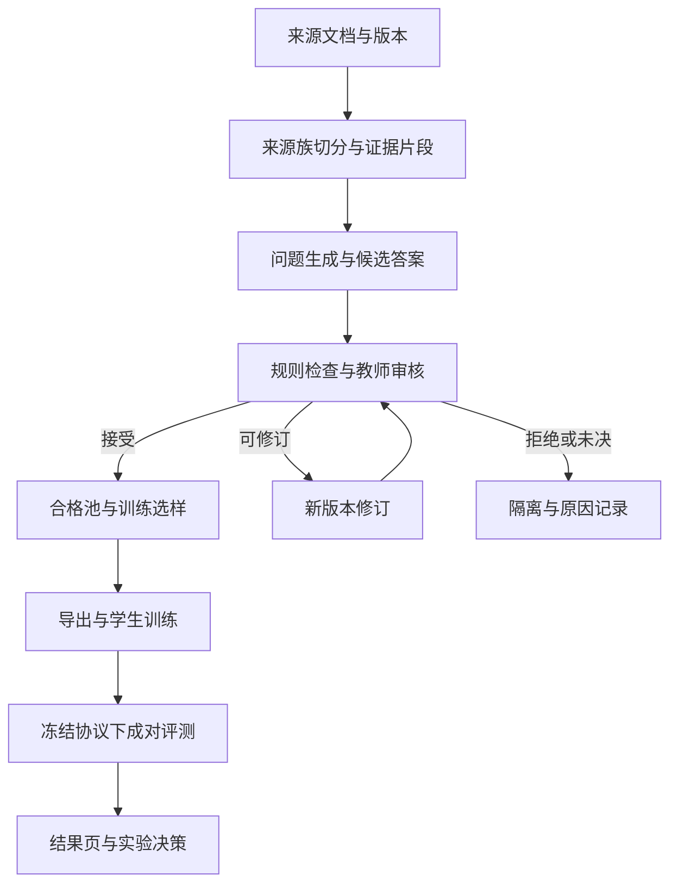

# 微调平台 QA 数据侧——QA 数据生成、蒸馏、教师校验与效果验证技术设计及实验方案

| 文档信息 | 内容 |
| --- | --- |
| 文档版本 | v3.1 闭卷实验与前端改版修订稿；此版本号仅用于本文，不是仓库发布版本 |
| 编写日期 | 2026-10-07 |
| 项目 | QA_generate：面向通用微调平台的 QA 数据生产与验证系统 |
| 代码基线 | `3866d2a131b26c08462b0e33746d5247e2a873bf`，提交说明“提供可查看结果” |
| 适用对象 | 项目负责人、算法与实验人员、后端与前端开发人员 |
| 文档状态 | 基于固定提交的实现核查、已提交指标与用户提供的运行报告；本次新增闭卷实验与前端重构设计，未执行新训练 |
| 参考格式 | `docs/archive/微调平台 QA 数据侧 — QA 数据生成、蒸馏及知识过滤技术设计稿.md` |
| 建议入库位置 | `docs/QA_generate_技术设计与实验方案_20261007.md`；保留旧稿作为历史设计 |

> **阅读结论：**项目已经完成从数据管线到真实教师审核、探索性推理和结果展示的初步闭环。当前可见结果是：历史 batch1 的 14 题中，10 题得到教师对照“持平”、4 题未决；实验 B 已执行 8/48 个条件输入，8 个均为“持平”。这些结果尚未证明 adapter 优于 base。下一步应先修正审核身份与评分口径、建立可复现基线，再执行有预设假设的对照实验。教师可临时代替人工承担筛选和探索性评分，但输出始终标记为教师判断。v3.1 将闭卷 QA 训练与改善验证提升为本期明确任务，与有资料问答分线推进；前端同步改为现代、明亮、圆润的实验工作台。

阅读顺序：第 2 章回答“现在有什么结果”，第 3 章解释“方法依据是什么”，第 4–5 章描述系统和算法，第 6 章规定实验，第 7–8 章说明前后端与通用化，第 9 章给出实施和验收。仓库证据与文献分别列在附录 A、B。新增闭卷方案集中在第 5.9、6.10 节；第 7 章重写展示与视觉规范；第 9 章明确 Cursor 下一步交付顺序。

## 1. 文档概述

### 1.1 项目背景与目标

QA_generate 将原始文档转成可训练的问答数据，并保留“答案从哪里来、经过哪些处理、为什么接受或拒绝、训练后是否改善”的证据。它服务于通用微调平台，医药说明书只是当前验证场景，不应成为核心数据结构、审核政策或前端页面的固定假设。

本文同时回答四个问题：怎样生成有依据的 QA；怎样在没有人工审核的阶段控制数据质量；怎样证明数据策略确实影响学生模型；怎样让使用者看到流程、中间结果、数据集信息和模型回答差异。

当前阶段的目标不是立刻证明所有策略有效，而是形成一条可检查的证据链：

1. 数据正确：问题可理解，答案符合任务约定，事实能对应证据。
2. 处理可追踪：每次生成、过滤、修订和审核均有身份与版本。
3. 实验可比较：两组模型除待研究因素外使用一致的输入和运行条件。
4. 结论有边界：报告分母、未决、来源重叠和评分限制，不把流程成功当成模型效果提升。

### 1.2 范围与任务约定

| 模式 | 学生模型实际看到什么 | 合格答案的依据 | 本期定位 |
| --- | --- | --- | --- |
| `rag_grounded` | 问题与明确提供的上下文 | 仅依据学生可见证据；证据不足时说明不足、澄清或部分回答 | 本期路线 A：有资料问答与证据行为 |
| `closed_book_domain` | 问题，无检索上下文 | 使用模型参数中的知识作答；教师用后台来源与参考答案核验 | 本期路线 B：闭卷训练、知识掌握与新问法效果对照 |

`rag_grounded` 并不表示仓库已经具备完整检索系统。当前实验可以直接提供冻结的上下文；检索器、索引和召回质量属于另一个可插拔层。只有接入真实检索后，才报告检索命中率等指标。

两个模式不得混用监督目标。同一条“删除证据”的输入，在 `rag_grounded` 下应说明资料不足；不能因为教师知道答案，就仍以完整事实答案训练学生。闭卷模式本来就不提供资料，不能仅因 `student_context` 为空而强制拒答；其事实正确性由后台冻结来源校验。两条路线分别训练、分别评估，第一期不混训两个互不相同的任务约定。

### 1.3 术语与证据等级

| 术语 | 本文含义 |
| --- | --- |
| 教师模型 | 负责生成、校验或评分的模型；角色不同不代表模型相互独立 |
| 学生模型 | 接受 SFT 的模型；当前历史学生为 Qwen2.5-7B-Instruct |
| 响应蒸馏 | 用教师生成并校验的答案作训练目标；本期不是 logits 蒸馏 |
| 来源家族 | 同一来源及其版本、改写和派生样本的分组，用于防止数据泄漏 |
| 金标候选 | 尚待审核的参考答案与评分要点；教师接受后称“教师参考标注” |
| 行为条件 | 完整证据、证据删除、对象错配、干扰文档等输入条件 |
| 未决 | 弃权、缺审核或技术失败等导致无法下结论；不得算作内容错误或正确 |
| 正式人工门禁 | 当前仓库中需人工标注才能通过的评测状态；纯教师记录不能开启 |

本文采用三类依据：**[E] 仓库证据**，指固定提交中的代码或报告；**[U1] 运行报告**，指用户粘贴的本轮 Cursor 输出；**[R] 外部研究**，指原始论文。仓库中存在指标文件表示可以核对已记录的结果，不表示本文重新执行了教师调用、GPU 推理或训练。所有“拟、建议、待实现”内容均为本轮设计。

## 2. 当前实现与实验进度

### 2.1 已经完成到什么程度

| 环节 | 当前状态 | 能支持的结论与限制 |
| --- | --- | --- |
| 文档切分、生成、蒸馏、过滤、分级、导出 | 核心管线和插件已实现 | 可组成数据生产流程；某个策略存在不等于其已完成效果验证 [E1] |
| 教师审核 | 已实现，且本轮有真实调用记录汇总 | 独立审核状态，不写成人工共识；当前是单教师探索政策 [E2、E5] |
| 历史 G0 训练 | 报告及历史产物曾核对 | 历史训练使用 74 条数据；脏工作区和 tokenizer 差异影响可比较性 [E7、E8] |
| batch1 历史预测评审 | 已有汇总结果 | 对旧回答重新审核，不是新训练结果 [E5] |
| 实验 B 小试 | 8 个条件输入、16 份新预测 | 真实推理小试已执行；父协议 48 条未全部完成 [E5、U1] |
| 正式人工评测 | 未完成 | `formal_ready=0`；不能声称人工准确率 |
| 新的干净 G0、G1–G3 因果对照 | 尚无本轮完成证据 | 不能用历史目录、配置或 Fake 套件证明策略有效 |
| 闭卷训练与改善对照 | 有闭卷导出分支；尚无本轮新闭卷对照结果 | 本次新增 CB-Base / CB-SFT 实验；闭卷与 RAG 的输入及 rubric 需统一分流 [E10] |
| 结果页 | `/results` 与查询接口已实现 | 可浏览本轮结果；完整在线问答、任务管理和数据集管理仍待补齐 [E6] |

用户报告全量测试为 **120 passed、0 failed、0 skipped**，实验 B 使用 GPU 3 生成 16 份回答、失败 0；这是 [U1] 中的执行记录，本文未在原 GPU 环境复跑测试。测试通过说明被测试的软件行为符合断言，不代表模型回答正确。

### 2.2 本轮可核对的真实结果

固定提交包含两个 `metrics.json`：`runs/batch1_view_20261007/metrics.json` 和 `runs/b_pilot_20261007/metrics.json`。两者字节相同，均为包含历史块与 B 小试块的联合快照，**不能计为两份独立重复实验**。[E5]

| 指标 | batch1 历史块 | 实验 B 小试 |
| --- | --- | --- |
| 计划范围 | 14 题，base/adapter 共 28 份历史回答 | 父协议 48 个条件输入，本轮选择 8 个 |
| 参考标注审核 | 接受 11、修订 0、拒绝 2、未决 1 | 接受 8、拒绝 0、未决 0 |
| 预测或对齐 | 按身份匹配 28/28；接受参考标注后审核 22 份回答 | base 8、adapter 8，生成失败 0 |
| 可计分回答 | base 11；adapter 10 | base 8；adapter 8 |
| 任务完成 / 行为适当 | base 均 11/11；adapter 均 10/10 | 两模型均 8/8 |
| 成对对照 | 改善 0、退化 0、持平 10、未决 4 | 改善 0、退化 0、持平 8、未决 0 |
| 辅助规则与教师分歧 | 9 条回答级记录 | 6 条回答级记录 |
| 正式人工门禁通过数 | 0 | 0 |

预算汇总为 **97/120 次调用、107092/200000 token**；金额与计价信息未知。教师服务为用户指定的 `http://192.168.4.110:4000/v1`，运行报告模型名为 `qwen3.8-27b`，revision 为 `unknown`。此名称记录的是服务标识，不能据此推断具体权重版本。[E5、U1]

分母必须分开理解：

- 历史参考标注接受覆盖为 11/14；有效成对对照覆盖为 10/14，约 71.4%。不能把条件性的 11/11 或 10/10 写成全体 14 题的准确率。
- B 小试已完成选中的 8/8，但只覆盖父协议的 8/48，约 16.7%。按运行报告，这 8 个条件属于两个核心问题的四种条件变体，并非 8 个独立来源实验单元。
- “97 次调用”不等于“审核了 97 道独立题”。探测、重试和多对象审核的具体构成需用原始账本解释。

最新两个运行目录在远程提交中只包含指标文件；本轮完整 `cases.jsonl`、审核原始记录、使用量账本和 `result_report.md` 未随这两个目录提交。详细例子及 GPU 执行信息目前依赖 [U1]；应补充可访问的产物清单和哈希，不必将大文件全部放进 Git。

### 2.3 现在能得出什么结论

已经得到的成果是：系统能调用真实教师、生成真实学生回答、保留审核状态，并展示逐题结果。这比只有 Fake smoke 或空协议更进一步。

目前没有观察到教师评分下 adapter 优于 base。它既不能证明微调有效，也不能证明微调永远无效，原因包括：当前题目可能较容易，教师标准可能不够敏感，历史模型配置不可控，小试来源少，且汇总方法较粗。应通过下一轮实验分别检验这些解释，而不是任意选择一个原因。

规则与教师分歧也不能直接作为训练信号。规则可能因表达差异误拒，教师也可能漏掉事实或行为问题。应先定位分歧属于哪一种错误，再决定修规则、修审核提示词或增补训练数据。

### 2.4 当前实现中需要优先解决的测量风险

| 问题 | 源码证据 | 影响与本期处理 |
| --- | --- | --- |
| 预测回答正文未完整进入审核缓存身份 | `prediction_subject()` 输出 `answer_text`；`subject_hash()` 哈希 `answer`，未哈希 `answer_text`；归一化未补映射 [E3] | 同一预测 ID 的正文变化可能复用旧审查。统一字段并升级缓存版本；保留旧记录、失效受影响缓存 |
| 评分要求未完整传给教师 | 当前探索性装配省略 `required_points`、`unavailable_points`、`condition_id`；预测审核也未传冻结参考答案 [E3] | 无法保证教师逐项核对评分要求。明确无参考审核/参考审核模式并保存实际请求 |
| “持平”来自粗粒度分数 | `rank = 任务完成 + 行为适当 + decision==accept` [E4] | 相同 rank 不等于内容等价；事实一致性等维度未进入此 rank。改为硬约束加多维结果 |
| 证据引用校验偏弱 | `_evidence_ok()` 检查引用列表非空等条件，未验证引用能定位且支持声明 [E2] | 非空引用不等于有效证据；增加引用解析、片段定位和声明支持检查 |
| 闭卷模式名不一致 | 导出按 `goal=closed_book_domain` 分支；`sft.eval_messages()` 仅识别 `task_mode=closed_book` 或特定 context_key [E10] | 缺显式 messages 时可能走入 grounded 分支。规范化别名并核对最终序列化请求；不能仅凭界面标签判断闭卷 |
| token 预算为回填累计 | `try_begin()` 检查已消费总数；响应后 `add_tokens()` 累计 [E2] | 多个在途请求可能超出 token 上限；无跨进程原子预留。升级为预留—结算账本 |

针对第一项，本文对固定提交中的实际哈希函数做了最小函数级检查：仅改变预测 `answer_text`，其 `subject_hash` 保持不变；改变问题则哈希变化。另以构造记录检查到：即使事实相关维度为 false，只要三个 rank 条件为真，当前汇总仍给出 rank=3。这两项是代码行为检查，**不是发现真实教师曾输出该构造记录，也不能据此断言已有 97 次调用全部受污染**。

## 3. 调研依据与适用边界

### 3.1 技术选择与研究证据

| 技术问题 | 原始研究提供的证据 | 本项目采用方式 | 不能直接推出的结论 |
| --- | --- | --- | --- |
| 能否用模型生成训练样本 | Self-Instruct 通过生成、过滤指令数据开展指令微调 [R1] | 使用生成—过滤闭环，保存生成条件 | 不能保证生成的领域事实正确 |
| 如何控制问题与答案类型 | MixQG 研究基于答案的多类型问题生成 [R2] | 问题类型与答案要点显式表示 | 不能证明越多题型越好 |
| 如何从来源文档生成可靠数据 | Source2Synth 将真实来源、合成与答案可回答性筛选结合 [R3] | 证据先行，审核可回答性 | 其表格和多跳任务收益不是本项目收益 |
| 是否需要知识结构 | GraphGen 以图结构组织知识和多粒度 QA，实验涉及闭卷推理 [R4] | 知识单元路线作为可选实验臂 | 本项目轻量知识单元不等于复现 GraphGen |
| 是否加入复杂改写 | WizardLM 的 Evol-Instruct 研究逐步演化指令 [R5] | 仅在证据约束下改写，复杂度变化留痕 | 不能把题目更长当成更有训练价值 |
| 如何训练对干扰文档的稳健性 | RAFT 对相关与干扰文档的训练组合进行实验 [R6] | 借鉴干扰条件设计 | 不能照搬其缺少黄金文档时仍输出原答案的目标 |
| 怎样检查事实 | FActScore 将长回答拆成原子事实，评估来源支持程度 [R7] | 声明级证据审核与事实覆盖统计 | 原论文的验证结果不能替代本项目中文任务校准 |
| 教师能否做裁判 | LLM-as-a-Judge 研究展示模型裁判可用性，并分析位置、冗长和自偏好等偏差 [R8] | 匿名审核、固定标准、诊断题和不确定状态 | 论文中的人机一致率不能套给当前单教师 |
| 如何用较少数据做 SFT | LIMA 在其模型和任务设定下研究少量精心选择数据 [R9] | 先保证质量，再讨论规模 | 不能据此断言本项目 74 条一定足够 |
| 如何降低训练资源需求 | LoRA 用低秩参数更新适配冻结基座 [R10] | 保留 LoRA 路线，冻结训练与加载配置 | 参数高效不等于一定改善任务效果 |
| 如何评价数据训练价值 | LESS 研究面向目标任务的梯度影响选样 [R11] | 学生诊断是低成本候选信号，最终靠对照验证 | 教师置信度或一次答对不能替代梯度影响或训练收益 |
| 如何控制重复与泄漏 | Lee 等研究训练数据去重及其对记忆、评估的影响 [R12] | 来源族切分、近重复检查、派生谱系 | 不能只做字符串去重就宣布无泄漏 |
| 如何分解 RAG 质量 | RAGAS 将上下文与生成质量分开衡量 [R13] | 分别报告证据支持、任务完成和行为 | 本期无真实检索时不报告端到端检索收益 |
| 如何减少遗忘 | SSR 研究自合成回放对持续微调的作用 [R14] | 回放为独立实验因素，使用冻结保留集 | 不存在可直接照搬的通用最佳回放比例 |
| 是否应过滤“学生不会”的知识 | Gekhman 等在闭卷 QA 下研究新知识学习与幻觉的关系 [R15] | 区分闭卷知识学习与有上下文作答 | 不能据此删除所有学生答错或未掌握的数据 |

以上文献支持技术方向和实验设计，不能替代本项目的内部效果证据。本文不宣称复现上述论文，也不把论文中的提升比例写成项目预期收益。

为说明这些研究的实验背景，而非只列方法名称，可重点看三项原始结果：Self-Instruct 在其 Super-NaturalInstructions 评测设定中报告相对原始 GPT-3 提升 33 个百分点 [R1]；LIMA 使用 65B LLaMA 和 1000 条精心整理的样本研究对齐 [R9]；LLM-as-a-Judge 报告强模型裁判在其研究设定中与人工偏好的一致率超过 80% [R8]。这些模型、数据、任务和评价方式均不同于当前 7B 学生及单教师中文 QA 场景，只能说明路线值得验证，不能为本项目的样本量或准确率背书。

### 3.2 从研究到本项目的三个关键取舍

**第一，直接证据生成作为起点，知识单元路线作为变量。**直接从片段生成 QA 较容易建立证据链，调用成本也容易统计。知识单元能帮助覆盖遗漏、组织多证据问题，但会增加抽取误差和调用成本。因此先固定 D 路线，再以 K 路线开展同预算对照。[R2–R4]

**第二，借鉴 RAFT 的干扰条件，重新定义缺证据时的目标。**RAFT 原文允许部分训练输入没有黄金文档而仍以原答案监督，并讨论域内记忆作用。本项目 `rag_grounded` 要求答案受到可见证据约束：支持证据被删除后，目标必须随之变为说明不足或部分回答。[R6]

**第三，把“数据是否合格”和“是否值得训练”分开。**合格性回答“这个答案对不对、有没有依据”；训练价值回答“在预算固定时训练它是否比其他数据更有收益”。前者依靠证据和审核，后者必须通过学生探测与训练对照验证。[R7、R11、R15]

## 4. 推荐技术路线与总体架构

### 4.1 总体数据流



来源、证据、样本、审核、训练、预测各有独立 ID 和内容哈希。结果页通过这些关联展示证据链，不能只保留最后一份 JSONL。

### 4.2 模块职责

| 模块 | 输入 → 输出 | 当前基础与待完善内容 |
| --- | --- | --- |
| 来源管理 | 文档 → 版本、来源族、切分归属 | 已有来源字段；需统一来源全集与冻结清单 |
| 预处理 | 文档 → 片段、结构、证据定位 | 已有 chunk 插件；需规范解析质量、位置引用 |
| QA 生成 | 片段/知识单元 → 问题、候选答案、声明 | 已有多路线插件；须记录实际执行路线 |
| 校验与审核 | 候选、可见证据 → 审核记录与政策结论 | 已有 reviewing；本期修身份、要点和证据校验 |
| 选样与回放 | 合格池、学生探测 → 训练清单 | 策略配置已有；缺探测/回放池时明确未执行 |
| 训练适配 | 冻结清单 → adapter、训练清单与日志 | 已有 LoRA 实验；需重建干净 G0 |
| 评测 | 冻结协议、预测 → 分维度结果与对照 | 已有规则和教师比较；需修汇总、补覆盖 |
| API 与前端 | 产物与事件 → 浏览、比较、交互 | 已有结果页；补数据集、流程明细和在线 Demo |

### 4.3 默认路线与资源控制

当前 `configs/recipes/recommended.yaml` 使用 `heading_window` 切分、`direct_grounded` 生成、`reuse_candidate` 蒸馏、单教师路由，以及规则、证据、去重、声明和风险等过滤插件。它是当前推荐配置的事实，不是所有组件已被证明最佳的结论。[E1]

两种任务都以“D 路线 + 证据校验 + 单教师探索审核”作为首轮数据方案，各自导出不同的学生输入与训练清单。不同时开启大规模复杂改写、多教师仲裁和大规模训练，否则很难知道新增成本来自哪里、效果又由哪个因素产生。风险升级、修订次数和总调用量必须显式配置。

## 5. 模块详细设计

### 5.1 输入预处理与证据管理

输入适配器将不同领域文档转成统一格式：`source_id`、`source_version`、`source_hash`、`source_family_id`、`title`、`language`、`text`、`sections`、`metadata`。领域字段保留在命名空间内，例如 `metadata.drug`、`metadata.device`，不向核心模式添加专用必填字段。

对于独立来源泛化评测，先确定来源族与 train/dev/test 归属，再生成 QA。同一来源的片段、版本、同义改写及行为变体继承相同归属。闭卷的“已训练知识、未见问法”诊断采用单独的知识暴露协议：允许训练与诊断涉及同一事实，但问题表达、整条测试 QA 和测试要点不得作为训练样本消费，必须标记为已见知识诊断，不能称为独立来源泛化。两种协议分别保存，禁止为闭卷诊断放开全部测试的来源隔离。清单记录文档全集、去重策略、种子、知识暴露关系和哈希。

在 `rag_grounded` 中，证据分为三类；闭卷任务另保留仅供教师使用的 `source_evidence_refs`，不把后台证据拼入学生输入：

| 类型 | 含义 | 可否作为学生回答依据 |
| --- | --- | --- |
| `construction_evidence_refs` | 构造问题、参考答案时使用的完整材料 | 只有确实进入学生上下文的部分才可以 |
| `student_context_refs` | 实际送入学生提示词的材料 | 可以，但仍需判断是否支持具体声明 |
| `visible_support_refs` | 学生可见材料中支持某个答案声明的片段 | 可以，需能够回到原文位置 |

目标引用格式为 `source_id + source_version + chunk_id + start/end + quote_hash`。文本规范化前后的偏移映射要保留；检查引用不能只判断“非空”，应能解析到冻结文本。原文命中只证明片段存在，语义支持仍需声明核对。

遇到空文档、乱码、表格字段错位和疑似不存在的输入路径，记录具体错误。不存在的文件路径不应悄悄成为待生成的正文。文档中的指令性文字按来源数据处理，不能覆盖生成和审核任务指令。

### 5.2 问题生成与覆盖

**D 路线：直接证据生成。**输入片段和目标任务，生成问题、候选答案、必要答案要点及引用；随后审核“问题是否由当前材料回答”“是否引入了没有依据的限定条件”。适合首轮可复现基线。

**K 路线：知识单元生成。**先抽取简短的原子事实、条件、实体关系及引用，再生成问题。顺序抽取和联合生成分别记录 `generation_route`，不得合并统计。知识单元漏掉条件或否定信息时，应回到证据修正，不能把抽取结果当成更高权威。[R2–R4]

每条问题按正交维度标注：

| 维度 | 例子 |
| --- | --- |
| 意图 | 定义、属性、条件、比较、步骤、限制 |
| 操作 | 定位、汇总、计算、比较、多段整合 |
| 证据形态 | 单片段、多片段、多文档 |
| 证据状态 | 充分、部分、缺失、冲突、对象错配 |
| 期望行为 | 回答、部分回答、澄清、说明不足、报告冲突 |

类型配额只能对“来源确实能够支持的类型”生效。文档没有可比较对象时，不为补齐比较题数量而虚构对象。覆盖缺口先生成补题计划；只有新样本完成实际生成、审核并进入清单，才算补题完成。

改写以语义不变为默认约束；若加入条件或多跳要求，必须建立新变体 ID、重新核对证据和参考答案。评测目录与训练补题目录分离，不能根据锁定测试的失败题反向生成训练样本。[R5]

### 5.3 答案蒸馏与事实校验

输出以简洁、可追溯的答案为主。确有必要时提供简短的证据说明或计算依据，训练目标不依赖冗长的推理展开。当前 `reuse_candidate` 会复用生成阶段候选答案，节省重复调用，但复用不免除校验。[E1]

建议按以下顺序过滤：格式与空值 → 原文引用定位 → 对象/数值/单位/否定/条件一致性 → 原子声明支持 → 任务与行为审核 → 重复检查。便宜的确定性检查应早于昂贵教师调用。

声明记录包含 `claim_id`、`text`、`status`、`evidence_refs`、`reason_code`。状态区分 supported、contradicted、insufficient。声明级检查借鉴 FActScore，但本项目需单独验证其适用性。[R7]

NLI 可用于发现证据与声明的蕴含/矛盾线索，向量相似度用于查找可能的重复和相关片段；两者都不能独立保证领域事实正确。模型缺失或回退为启发式时，写出 `executed_backend`、`fallback_reason`，不要展示成真实模型打分。

可修订样本产生新版本，保存父版本、修订原因和变化字段。修订后重新校验；超过次数上限进入隔离。技术失败、预算停止和内容拒绝分别记录，防止把服务不稳定误认为数据质量差。

### 5.4 行为数据：证据变化时应该怎么回答

以下为**合成说明例**，用于解释行为约定，不是本轮实验样本：问题为“设备 A 的额定输入电压是多少？”完整资料为“设备 A 额定输入电压为 12 V；设备 B 为 24 V”。

| 条件 | 学生看到的材料 | 期望行为 | 错误类型 |
| --- | --- | --- | --- |
| 完整支持 | 包含设备 A 的 12 V | 回答 12 V 并指向设备 A | 有证据仍拒答；对象混淆 |
| 删除支持 | 删除设备 A 的电压，其他信息保留 | 说明当前资料不能确定 | 凭记忆或剩余数字猜测 |
| 对象错配 | 只提供设备 B 的 24 V | 指出对象不符，不能确定 A | 把 B 的参数用于 A |
| 加入干扰 | A 的有效证据与无关段落同时存在 | 仍正确回答 A 的参数 | 随干扰内容改变答案 |
| 部分支持 | 问电压与电流，但只给出电压 | 回答电压，说明电流缺失 | 全盘拒绝，或补出电流 |

四种基础条件可沿用实验 B 结构；部分支持、冲突和澄清另建协议，不在本轮看到结果后随意加入旧分母。删除证据应检查是否残留等价支持信息，否则“缺证据”条件不成立。

不能把所有非完整答案统一叫拒答。资料不足说明、范围限定、澄清和部分回答具有不同任务目标，应分别统计。

### 5.5 教师模型替代人工的审核方案

#### 5.5.1 当前部署与角色

当前使用一个 OpenAI 兼容服务，地址由运行配置注入：`http://192.168.4.110:4000/v1`，模型标识为 `qwen3.8-27b`。revision 暂未知，记录为 `unknown`，并保存服务指纹、模型列表快照及实际请求时间。核心代码不绑定该地址或型号。

教师承担两类审核：

1. **样本/参考标注审核**：检查问题、参考答案、证据状态和期望行为是否成立。
2. **预测审核**：对学生真实回答逐项检查事实、要点与行为；不向裁判暴露 base/adapter 身份。

生成教师与审核教师可以来自同一服务，但此时存在相关错误风险。重复调用同一模型、换提示词或换角色不等于独立教师共识。多教师政策应在确实获得可区分的模型版本后启用；模型身份只能由配置声明时，标注“独立性未验证”。[R8]

#### 5.5.2 审核输入与输出

| 输入字段 | 用途 |
| --- | --- |
| `subject_type/id/version` | 审核对象、身份与版本 |
| `question`、`student_context`、`messages` | 学生真正看到的输入 |
| `answer_text` | 当前待审答案，统一为唯一标准字段 |
| `reference_answer`、`reference_hash` | 参考审核模式的冻结标注；无参考模式显式置空 |
| `required_points`、`unavailable_points` | 必须回答和不得补出的内容 |
| `expected_action`、`condition_id`、`task_mode` | 当前条件及行为约定 |
| `evidence_snapshot`、`rubric_version` | 可定位证据与评分标准 |
| `judge_source_context`、`source_evidence_refs` | 闭卷审核使用后台来源；与学生实际可见输入分开保存 |

输出保持结构化：`decision` 为 accept/revise/reject/abstain；`execution_status` 单独表示执行结果；`dimensions` 包含事实一致、要点完成、行为适当、证据充分、无无依据声明等；另有声明级引用、错误原因、简短证据说明、模型身份及 token 使用量。

教师自报的 confidence 不作为概率。没有独立校准依据时保留 `confidence_calibrated=false`。accept 可以没有错误码，但对规则分歧必须给出能够核对的说明，不能只有“正确”二字。

#### 5.5.3 接受政策与状态转换

确定性校验通过、必要审核维度通过、引用有效且不存在未解决的事实问题，才能按单教师政策进入 `teacher_single_accepted`。待修订、拒绝、弃权和技术失败分别进入对应队列。当前政策已有四个关键维度硬检查；本期需要按对象类型补齐任务完整性与证据解析条件。[E2]

训练样本与探索性参考标注分别设置就绪状态：`ready_for_training`、`ready_for_exploratory_inference`。所有 teacher-only 记录保持 `ready_for_formal_human_eval=false`。这不阻止开展教师辅助实验，而是保证结果名称准确。

#### 5.5.4 身份、缓存与预算

预测身份与审核身份必须分层：模型输入哈希描述学生看到的内容；预测哈希再包含模型、生成配置与回答正文；审核哈希再包含参考标注、评分要求、教师版本、提示词、政策及证据快照。改参考答案无需重做未变的学生推理，但必须失效受影响的审核。

所有新增字段进入规范化 JSON 后统一哈希；缓存键增加 schema 版本。先修 `answer_text` 遗漏，再判断哪些旧缓存可以复用。结果聚合以内容身份匹配，不能只按 `subject_id` 取最后一条记录。[E3、E4]

预算账本采用请求前预留、响应后结算：在共享事务中预留一次调用及输入估计 token + 最大输出 token，真实 usage 回填差额。流式中断或 usage 缺失时保留未结算状态，不当作零消费。单机多进程可用 SQLite 事务；多服务部署再迁移数据库。当前已实现的历史账本回放不能替代跨进程并发互斥。[E2]

### 5.6 学生诊断、训练价值与回放

学生诊断至少记录：有证据条件的正确性、去证据条件的行为、不同问法的一致性及实际探测状态。一次答对可能来自猜测或表面匹配；一次答错也可能恰好代表值得训练的缺口。不得将“教师觉得简单”直接等同于“学生已掌握”。

质量与价值分开存储：`validity` 表示是否合格；`selection_reason` 和 `training_weight` 表示为何训练或降权。知识过滤不能破坏行为覆盖：即使学生已经知道某个事实，也可能仍需学习证据缺失时限制回答。

建议依次比较三类干预：随机选择合格数据、基于真实学生探测选样、加入冻结回放池。不存在真实探测器时标记 `not_executed`；不存在冻结回放池时不生成“已回放”结论。LESS 与 SSR 支持研究方向，但本项目尚未实现或验证它们的完整方法。[R11、R14]

回放池来自合法可用、与测试隔离的通用任务数据，保留来源和版本。分别研究“总训练 token 固定，回放替换部分新数据”和“新数据不变，额外增加回放”两种问题，不能将额外计算的收益全部归因于回放方法。

### 5.7 导出、训练与可复现清单

训练导出由任务模式决定：`rag_grounded` 包含问题、学生可见上下文和目标回答；`closed_book_domain` 包含闭卷 system policy、问题和目标回答，不带来源正文。审核说明、参考要点、后台证据与模型身份等审计字段不拼入学生输入。数据消费清单记录实际训练的 sample ID、版本、有效 token 数及权重，检查配置中的降权或排除是否真正被训练器采用。

LoRA 训练固定基座权重、tokenizer、chat template、special tokens、LoRA 配置、优化器、学习率、batch/梯度累计、最大长度、训练 token 预算、精度和随机种子。评测 base 与 adapter 时使用一致的 tokenizer 与输入模板；adapter 必须加载到匹配的基座。[R10]

建议每个新 run 生成 `manifest.json`：代码 commit、工作区 diff 哈希、环境锁文件、数据及划分哈希、模型标识与内容指纹、配置、种子、开始结束时间、产物清单。正式可复现基线使用干净提交；有未提交修改的探索运行可保存完整补丁，但必须标识，不能冒充该 commit 的纯净执行结果。

### 5.8 去重、质量分级与训练选择

去重分三层：规范化问答的精确重复、同一来源家族的语义近重复、跨来源的疑似重复事实。向量检索只产生候选对，最终合并需保留“哪个条件、哪个对象、哪个答案要点相同”的依据。完整证据与证据删除的行为变体即使问题相同，也不是应直接合并的重复样本。

质量状态建议先分“合格、待修订、隔离、拒绝”，再在合格池内使用现有分级体系。等级可以表达证据完整度、审核充分程度和风险范围，但不能掩盖关键事实失败；教师 confidence 不直接决定最高等级。合格但低训练价值的样本可以降权，事实不合格的样本不能通过降权混入训练。

如采用样本权重，目标是按有效 assistant token 计算加权 SFT 损失；应在清单中保存原始质量、选样理由与实际权重。当前写入样本的权重字段是否被训练器实际消费，必须以训练数据加载和 loss 计算为准。推荐先以等权重 G0 建立基线，再单独研究加权策略，避免把审核改进、数据选择和训练权重同时作为一个实验变量。

### 5.9 闭卷 QA：把知识学习落实为独立训练路线

闭卷路线要回答的是：在不给参考资料的情况下，微调后模型对训练涉及的知识，是否能更准确、稳定地回答新问法，以及是否损伤已有能力。普通 QA 微调不保证成功写入新知识，因此同时检查事实错误和能力退化。[R4、R15]

#### 5.9.1 输入与审核边界

教师在数据生成、答案校验和评分时可以看到来源文档；学生在训练和评测推理时只看到任务指令与问题。目标答案只在训练的 assistant 位置参与监督。评测请求不得带参考答案、要点、原文、检索结果或包含答案的历史对话。问题可以包含必要的对象、型号和版本标识，不能把待求事实改写进题干。

统一以 `task_mode=closed_book_domain` 作为规范值；兼容旧 `closed_book` 与 `metadata.goal`，但规范化之后只保留一个权威字段。显式 messages 与 task_mode 冲突时返回错误，不静默采用其中之一。核查所有入口，尤其是 `adapters/zhixun.py::build_messages`、`sft.py::eval_messages` 和 `adapter_eval.py::canonical_messages`。[E10]

本次对固定提交的 `eval_messages()` 做了最小函数级检查：没有显式 messages、使用 `closed_book_domain` 且带 context 时，会进入 grounded 分支并拼入该 context；旧值 `closed_book` 会进入无上下文分支。此检查未调用模型，只证明该入口的分支风险，不代表已有全部预测都走过此路径。

闭卷答案审核使用 `source_evidence_refs` 和冻结参考要点判断事实，不套用“学生没有可见证据，所以不能回答”的 RAG 规则。来源确实不足或对象不明确时，允许说明不确定或澄清；来源充分且问题明确的样本不能自动转换成拒答训练。

#### 5.9.2 数据与训练输出

每个事实或紧密关联的知识点具有 `knowledge_id`，记录来源族、版本、声明及训练暴露情况。生成一条训练问法和独立保留的新问法；先冻结协议，再做 base 推理和训练。训练加载器只消费训练清单，评测 QA 和裁判说明留在独立目录。

首轮优先复用可追溯的历史合格池，但逐条检查：问题脱离原文后是否仍明确、答案是否需要上下文才能解释、能否定位来源。不能简单删掉原来的 context 就宣布已经得到合格闭卷数据，也不能把历史 74 条全部默认视为闭卷可用。

输出至少包括闭卷训练 JSONL、知识暴露清单、来源参考清单、冻结评测协议、消费清单、adapter 与两组真实预测。训练预算、基座、tokenizer 和模板按第 5.7 节冻结；先单独训练 CB-SFT，混合闭卷与 RAG 的共享 adapter 留作后续消融。

#### 5.9.3 功能验收

检查最终送入 tokenizer 的 system/user 内容与哈希，而不只看上游 `context=""` 字段；确认不自动拼接资料、参考答案、few-shot 答案或历史检索缓存。用可辨识的测试标记检查来源/参考字段未泄露，并核对 assistant-only loss mask。修改后台参考标注应失效审核，而不改变原本未变的学生输入身份。

这一步的产物是“能够确认输入确实为闭卷的执行链”。模型是否改善，必须看第 6.10 节的真实对照。

## 6. 评估指标与接续实验方案

### 6.1 先回答研究问题，再选择指标

| 编号 | 研究问题 | 实验方法 | 主要判断依据 |
| --- | --- | --- | --- |
| H0 | 教师是否能识别本项目关心的明显错误？ | 可机械核对的正误诊断对、历史分歧复核 | 错误接受数、正确答案误拒数、未决率、逐项原因 |
| H1 | 当前 adapter 是否改变了证据条件下的作答行为？ | 完整 B 协议的成对推理与校准后审核 | 各条件通过率、无依据作答、过度拒答、成对差异 |
| H2 | 新的可复现普通 SFT 是否产生收益？ | base 与新 G0，冻结评测集 | 独立来源任务成功、行为错误和通用保留表现 |
| H3 | 行为样本是否带来额外收益？ | 新 G0 与行为增强臂，控制训练预算 | 删除证据/对象错配收益，以及完整证据题是否退化 |
| H4 | D 与 K 路线哪个更有效率？ | 同来源、同预算生成，再训练对照 | 合格数据产出/成本与独立来源收益 |
| H5 | 学生诊断和回放是否有价值？ | G0–G3 因素对照 | 相同训练预算下目标任务增益及通用能力保留 |
| H6 | 闭卷微调是否改善了知识作答，并保持原有能力？ | CB-Base / CB-SFT，相同无上下文输入；知识记忆、新问法、保留任务分层 | 事实正确性、错转对/对转错、改写稳定性、错误断言与保留表现 |

H0 是共同的测量系统检查；H1 是现有模型诊断；H2–H6 研究训练干预。闭卷 H6 不以完成整个 RAG A/B 或 G1–G3 为前提：模式、审核和数据准备通过后即可按独立预算推进。前端先展示已有真实结果，随后接入新闭卷结果。

### 6.2 评分口径 v2：硬约束与多维结果

对每份预测分别产生以下结果，不把所有信息压成一个三项相加的 rank：

| 维度 | 判定对象 | 处理方式 |
| --- | --- | --- |
| `factual_consistency` | 有关事实是否与有效证据一致 | 关键事实错误为硬失败 |
| `no_unsupported_claims` | 是否添加无证据支持的事实 | `rag_grounded` 下关键无依据声明为硬失败 |
| `required_points_complete` | 是否覆盖当前可回答的必要要点 | 区分必需点、可选点和当前不可回答点 |
| `behavior_appropriate` | 回答/部分回答/澄清/不足说明是否合适 | 按冻结条件和目标行为判定 |
| `evidence_valid` | 引用是否存在、可见并支持相应声明 | 定位检查与语义检查分开记录 |
| `execution_status` | 生成与审核是否完成 | 技术失败与弃权保持未决，不并入语义失败 |

`task_success` 建议定义为：该样本必需维度均通过，且没有关键事实错误或无依据声明。闭卷模式的支持依据是裁判后台的冻结来源，不是学生可见上下文；纯粹缺少检索上下文不构成事实错误。维度适用性由任务模式和冻结 rubric 决定；不适用记 N/A，不擅自当 true。证据不足题的“任务成功”是正确说明边界，不是复现隐藏的完整答案。

成对比较先报告完整维度向量。主结果使用四种可解释状态：仅 adapter 成功、仅 base 成功、两者成功、两者失败；有一方未决则另列。双方都成功并不代表文本完全等价。可另做匿名偏好比较，但不能取代事实与行为的硬要求。

### 6.3 核心指标与分母

| 指标 | 定义 | 必须同时展示 |
| --- | --- | --- |
| 参考审核接受率 | 接受参考标注数 / 计划参考标注数 | 拒绝、修订、未决及版本 |
| 预测完成率 | 有有效输出数 / 计划模型输出数 | 生成失败、超时、未执行 |
| 审核覆盖率 | 有有效审核数 / 计划预测数 | 弃权、技术失败、未审核 |
| 成对覆盖率 | 双方均可判定的输入数 / 计划输入数 | 共同覆盖集合及未决原因 |
| 条件任务成功率 | 该条件成功数 / 该条件有效判定数 | 有效判定数 / 该条件计划数 |
| 无依据作答率 | 缺证据条件下仍提出无依据答案数 / 可判定的相应输入数 | 条件类别、关键声明及来源 |
| 过度拒答率 | 充分证据条件下错误拒答数 / 可判定的充分证据输入数 | 合理澄清与拒答的区别 |
| 干扰影响 | 同核心题的完整支持与加入干扰条件之间的成功变化 | 完整条件对数，不能混不同问题 |
| 声明支持率 | 有支持的可判定事实声明数 / 可判定事实声明总数 | 未决声明、矛盾声明、空答案处理 |
| 成本效率 | 有效接受样本数 / token 或可确认费用 | 总调用、失败消耗、未知价格 |

未决不能直接当正确，也不能悄悄删除。可以另报 `成功数/计划数` 作为保守完成指标，但应命名为“已确认成功覆盖”，不能与条件正确率混淆。所有比率保存 numerator、denominator、unit、scope、rubric_version 和 missing_reason。

### 6.4 E0：审核与评分诊断，最高优先级

**目的：**先判断教师评分能否区分明确的对错，并排除缓存和装配问题。

**第一步：修复测量链。**统一预测正文，升级审核缓存 schema，补齐评分要点与条件，验证证据引用，修正多维聚合。保留旧报告，并明确标记旧 rubric 与新 rubric 不可混算。增加针对真实风险的回归检查：回答变化、参考要求变化均使相应审核失效；学生输入未变则不无谓失效推理缓存。

**第二步：建立 40 份答案的冻结诊断集。**建议构造 20 对“正确回答—只改变一个因素的错误回答”，覆盖对象、数值/单位、条件/否定、缺证据仍回答、有证据却拒答五类，各 4 对。使用短小的合成说明文本，答案可由明确规则核对。这是程序化诊断标签，不是人工金标，也不能估计真实业务准确率。

**第三步：匿名审核与一次迭代。**保存每份实际请求和响应，统计正确接受、错误接受、误拒和未决。建议首轮工程放行条件：20 个明确错误中无关键错误被接受，20 个正确答案至少 18 个被接受，其余全部给出原因。该阈值是本项目建议的诊断门槛，不来自论文，也不代表业务已达到 90% 准确率。若未通过，最多先做一轮有原因的 rubric 修订；调过的诊断集转为回归集，再用新的隐藏变体确认，不能在同一套已调题上宣称泛化。

**第四步：复核真实分歧。**取历史 9 条与 B 小试 6 条规则分歧，逐条列出规则触发位置、教师证据、冻结期望和修订后结论。先核对它们对应的输入、输出和审核身份；无法取得原始产物的条目保持证据不全，不猜测原因。

**交付：**评分说明、诊断混淆表、15 条分歧清单、旧新结论变化列表及结果页入口。即使教师仍无法可靠区分错误，这一轮也必须交付明确的问题定位，而不是只汇报测试数量。

### 6.5 E1：完成现有 A/B 诊断协议

**在 RAG 诊断分线内先 B，后 A；闭卷首轮实验与前端改造无需等待 A/B 全部完成。**B 直接检验可见证据是否驱动作答，是当前主任务最迫切的问题；A 用来判断对训练来源的问法稳健性。

| 项目 | 实验 A：问法稳健性 | 实验 B：证据条件行为 |
| --- | --- | --- |
| 已有协议 | 30 个核心问题 × 3 种问法 = 90 输入 | 12 个核心问题 × 4 个条件 = 48 输入 |
| 来源性质 | 训练中见过的来源，学习诊断 | 已有报告记为开发集来源，需重新核对冻结清单 |
| 当前结果 | 历史存在部分原题预测可对齐，不是完整新实验 | 本轮完成 8 个输入、16 份预测 |
| 研究变量 | 问法变化 | 完整支持、删除支持、对象错配、干扰 |
| 统计单位 | 核心问题与来源家族 | 核心问题与来源家族 |
| 结论范围 | 已见来源上的表达稳健性 | 开发协议下的行为表现，仍属探索性 |

执行前冻结输入、参考标注、rubric、模型配置和选择规则；先生成所有受控预测，再评分。历史预测只有在模型与输入身份完整匹配时复用；历史脏工作区或 tokenizer 差异仍需保留限制。要比较微调处理效应，应换成新的干净模型对照，不能仅给旧 adapter 换个标签。

B 的 8 个旧输入只有在审核身份和新政策下可核对时才复用评分。若重审，原回答可以保留，审核记录另开版本；模型配置需要统一时才重新推理。完整 B 的报告保留所有 48 个计划输入，包括未审核或失败项。

**交付：**每种证据条件的分母与结果、逐题并排回答、成对改善/退化/共同失败/未决列表。选例仍用预先固定规则，类别缺失就明确显示缺失，不寻找其他含义的样本充数。[E4、E8]

### 6.6 E2：建立新的可复现 G0，并检验行为训练

本节 E2 指 RAG 路线。先构建新的来源全集与分组切分，划分开发集与锁定测试集。已用于修改 rubric 和挑选方案的 A/B 题不能再作为最终独立测试。

建议首轮独立测试争取至少 30 个来源家族，每个来源构造四个基础条件，共约 120 个输入；这是起始规模建议，不是充分统计功效的保证。来源不足时报告实际独立家族数，不用同一文档的改写凑足独立样本。后续规模依据成对分歧率和最小有意义收益进行估计。

| 对照臂 | 训练数据 | 目的 |
| --- | --- | --- |
| Base | 不做本轮训练 | 原始学生能力参照 |
| G0-clean（RAG） | D 路线的合格普通 QA，提供学生可见上下文，冻结清单 | 检验普通 SFT 是否产生可复现变化 |
| H-behavior | 在固定总训练预算内，用行为样本替换预设比例的普通 QA | 单独检验证据行为训练 |

H-behavior 首轮可预设替换比例 20%，仅作为待验证起点；记录样本数与有效训练 token，优先匹配总训练 token 和优化配置。改变比例、增加训练轮次或同时更换数据生成策略，应成为新实验，不能计入同一单因素对照。

先用一个 seed 完成训练与评测流程。若观察到可解释的收益且没有明显退化，再以预设的三个 seed（例如 42、43、44）验证稳定性。对每个 seed 展示结果，不把三次运行当成三倍独立测试题。

成功标准应在训练前填入协议，例如：缺证据错误下降达到预设实际意义，完整证据任务与通用保留任务不出现超出预设容忍度的退化。阈值依据产品目标设定；本稿不虚构目前没有的基准值或保证提升百分比。

### 6.7 E3：生成策略、学生选样与回放消融

只有在 G0-clean、评分和独立测试稳定后再开展。优先做 D 与 K 的同预算比较，指标同时看合格产出、覆盖和训练后表现；不能只比较生成了多少条 QA。

随后保持历史 G0–G3 的语义，避免与行为训练臂混名：

| 组别 | 学生诊断选样 | 回放 | 必备条件 |
| --- | --- | --- | --- |
| G0 | 无 | 无 | 冻结合格池与基线采样策略 |
| G1 | 有 | 无 | 与待训练学生一致的真实探测器 |
| G2 | 无 | 有 | 冻结回放池、替换策略和预算 |
| G3 | 有 | 有 | 以上两项均具备 |

主对照固定总训练 token；额外增加回放预算另列实验。需要记录实际消费清单，证明策略改变了训练分布。若 G1 与 G0 实际消费的数据或权重相同，不能把它们称为有效干预。

不把全部生成路线、行为比例、回放比例和模型种子一次做笛卡尔积。每完成一个可解释对照再扩展，否则成本膨胀且结论难以归因。

### 6.8 统计与结论规范

所有模型在相同冻结输入上做成对比较。按来源家族聚合，并按家族重采样估计差值的不确定性；不要将一个问题的三种问法或四个条件视为独立样本。显著性方法需适配指标、配对关系和样本结构，不能只因工具能输出 p 值就使用。[R16]

当前 B 小试只有两个核心组，不给出看似精确的总体置信结论。扩大实验后同时报告效应大小、覆盖、置信区间和实际意义；样本不足或区间跨越零时明确说证据不足。多组筛选只在 dev 进行，锁定测试用于最后确认。

全部教师指标标为“教师辅助评价”；若将来补人工审核，应报告审核采样方法、人机分歧和实际覆盖，再讨论与人工一致性。单教师的稳定输出只能说明重复性，不能自动证明正确性。

### 6.9 调用预算与执行分批

当前共享额度剩余 **23 次调用、92908 token**。调用次数往往先耗尽，不能仅因 token 充足就启动大批次。下面只估算单教师、每对象一次审核的理想调用数，不含重试、探测和修订，也不是新预算授权。

| 批次 | 理想教师调用量 | 说明 |
| --- | --- | --- |
| E0 程序化诊断 | 40 | 40 份答案各一次；重试额外预留 |
| 现有历史与 B 小试全部参考重审 | 22 | 历史 14 + B 小试 8 |
| 已审核预测按新 rubric 重审 | 38 | 历史 22 + B 小试 16；参考标注状态变化时重新规划 |
| 完整 B 从头审核 | 144 | 48 份参考 + 96 份预测 |
| B 若 8 个旧输入全部可复用，仅补剩余 | 120 | 40 份参考 + 80 份预测；不可与上行重复计费 |
| 完整 A 从头审核 | 270 | 90 份参考 + 180 份预测；可核对缓存时再扣减 |

每批先输出 `planned_objects`、预计请求/token 上界、已可复用数量、预算不足时能完成的明确子集；推理 GPU 预算另列，不混入教师 API 账本。批次边界和选题顺序在看到新答案之前固定。

### 6.10 CB-1：闭卷训练与改善验证，本期必做分线

#### 6.10.1 对照与问题

主对照固定相同无上下文输入、同一基座、tokenizer、闭卷系统指令和解码配置：`CB-Base` 为未做本轮训练的基座，`CB-SFT` 为从该基座得到的新闭卷 adapter。历史 G0 不能自动替代 CB-SFT。

可以额外运行“同一基座 + 标准证据”的有资料诊断，帮助判断问题是否可回答，但单独列为参考条件，不把它与闭卷结果合成总准确率，也不将其差值当作微调收益。首轮不要求额外训练一个 RAG adapter 才能完成闭卷对照。

#### 6.10.2 四类评测范围

| 子集 | 训练暴露与输入 | 回答的问题 | 结论边界 |
| --- | --- | --- | --- |
| CB-memory | 训练中实际出现的 QA，闭卷重问 | 是否记住监督样本 | 仅学习诊断，不作泛化主指标 |
| CB-paraphrase | 训练涉及的同一知识；未进入训练的新问法 | 能否脱离原句稳定作答 | **本期主指标**；叫“已训练知识的新问法”，不叫未见知识泛化 |
| CB-composition | 构成答案的必要事实均已训练；新组合问题未训练 | 能否组合已掌握事实 | 可选后续实验，逐项证明组成事实暴露关系 |
| CB-retention | 不进入本轮训练的冻结通用/原有能力题 | 是否损伤原有能力 | 独立报告全体结果与 base 原本答对的子集 |

完全没有进入训练、又没有提供上下文的新文档事实，不能用来宣称本轮已学入模型。若单独测这类题，命名为 CB-unseen/control，记录 base 的既有表现，只作边界对照。测试题身份与其知识暴露身份分开保存。

#### 6.10.3 第一轮规模、顺序与限制

第一轮采用小型、可复现的探索实验：闭卷训练最多 100 条通过审核的 QA；从实际训练知识清单按事先固定规则选 10 个知识单元，各保留 2 个新问法（20 输入），再加入冻结的 20 个保留任务，总计 40 个主评测输入、base/adapter 共 80 份预测。实际可用知识不足 10 个时如实减少并报告，不补入未训练事实凑数。CB-memory 作为额外诊断单列预算，不混入 40 个主评测输入。

这些数量是首轮工程与学习诊断预算，不是充分样本量的证明，也不保证 100 条数据能够产生明显收益。候选来源、训练 QA、改写规则、保留任务和 rubric 在查看该轮模型输出前冻结。不得只挑 base 答错的题作为唯一测试；若分析此子集，必须同时报告全体结果，避免选择偏差。

执行顺序：合格闭卷数据与来源校验 → 冻结知识/题目清单 → CB-Base 推理 → 单 seed CB-SFT 训练 → 同配置推理 → 匿名教师审核 → 成对结果与案例页面。先使用一个 seed；有可解释的变化后，再根据预算扩展知识范围与三个 seed。

#### 6.10.4 主指标、改善与停止条件

CB-paraphrase 主指标是来源支持下的任务成功率，另报告必要事实点正确率、两种新问法的联合成功率及回答互相矛盾的数量。实体、数值、单位和限定条件可增加确定性检查；语义答案由校准后的教师辅助评价。EM/F1 仅作辅助，不把表述不同直接当错误。

在相同的有效配对集合上统计：错转对、对转错、两者正确、两者错误和未决。净改善为 `(错转对数 - 对转错数) / 有效配对数`；同时展示计划分母与审核覆盖。此指标只描述相应子集，不把 CB-memory 的高分混入 CB-paraphrase。一个知识单元的两种问法相关，按 knowledge_id/来源家族聚合，不把 20 条问法视为 20 个完全独立知识点。

“base 一次答错、微调后答对”描述观察到的表现变化，不直接证明从前完全不具备该知识；若要研究新知识习得，可另设受控合成知识或重复探测协议，不能回溯性改写本轮结论。[R15]

若训练 loss 下降但 CB-paraphrase 不变，只能报告学习/记忆现象，检查覆盖、题目歧义、监督目标和训练消费；若出现明显 CB-retention 退化，先定位错误，再单独研究回放。首轮不以必须正向提升为验收条件，但必须产出真实训练记录、80 份计划预测的状态、改善/退化案例及可解释的结论，不能以 dry-run 代替。

#### 6.10.5 数据字段与预算

新增或规范化 `knowledge_id`、`exposure_group`、`eval_subset`、`train_seen_fact`、`train_seen_question`、`reference_hash`、`source_evidence_refs`、`input_mode_verified`；这些是待实现契约，不是现有字段已全部可用。

40 个输入按每题一次参考审核、每份预测一次单教师审核估算，主评测至少需要 `40 + 80 = 120` 次调用，另加训练数据审核、生成、诊断和重试；已有可验证审核缓存可扣减。训练和 GPU 推理资源单独估算，先保存预算计划与明确上限。旧共享额度只剩 23 次，不能满足整轮；额度不足时继续完成数据契约、页面和离线校验，将剩余真实调用与 GPU 阶段标为具体资源阻塞，不伪造结果或自动扩容预算。

## 7. 前端展示方案、外观风格与数据契约

### 7.1 改版目标与现有问题

目标是让使用者在一屏内回答：“当前跑了什么、是否完成、模型有没有改善、差异具体在哪里”，再进入证据和技术细节。第一屏优先展示结果与可操作入口，运行日志、commit、哈希和底层字段放在展开区。

现有页面的宋体标题、Literata 数字、灰绿色大背景、直角边框和 `10px 10px 0` 的实心偏移阴影，造成类似纸面报告的视觉感；表格先行、内部 case ID 居多，则让用户难以直接理解结果。[E6] 本轮采用**现代、明亮、圆润的研究工作台**：浅中性背景、白色内容区、无衬线字体、适度圆角、轻边界与克制阴影。

保留已有 FastAPI、数据服务与页面入口，优先在原 HTML/CSS/JS 基础上组件化。第一期不把整体迁移到新前端框架作为先决条件；新增依赖必须有具体收益并锁定版本。旧 `/results` 继续可用或兼容跳转，历史报告不被删除。

### 7.2 信息架构与阅读顺序

全局左侧导航包含“概览、数据与流程、效果对比、问答体验、实验记录”。顶部保留项目、运行批次、任务模式与执行状态。任务模式用清晰的分段控件：**有资料问答 / 闭卷问答**，对应规范值 `rag_grounded` / `closed_book_domain`；切换时同步改变指标、案例和 Demo 输入，不能只换标题。

| 页面 / 工作区 | 第一屏回答什么 | 主要展示形式 | 点击后看到什么 |
| --- | --- | --- | --- |
| 概览 | 目前做到哪一步，下一步是什么 | 一句事实结论、至多 4 个关键数字、最近实验 | 运行详情或对应问题列表 |
| 数据与流程 | 数据从哪里来，在哪一步变少或被隔离 | 阶段进度带、输入/输出计数、来源与样本列表 | 片段、QA、审核、修订、导出版本 |
| 效果对比 | 微调有没有改善，在哪些题改善 | 同分母成对结果、各子集条形图、逐题并排回答 | 来源证据、关键事实差异、裁判理由 |
| 问答体验 | 同一个问题两模型如何回答 | 共享问题区、双回答区、模式说明 | 实际输入、引用、耗时与错误状态 |
| 实验记录 | 这份结果怎么得到，能否复现 | 运行列表、协议摘要、训练曲线、预算与产物 | manifest、配置、日志、下载链接 |

在“数据与流程”内部设置“数据集概览 / 处理过程 / 样本”三级标签，不再把所有信息塞进同一张大表。支持从结果案例反查数据集与来源，也支持从样本进入它参与的训练和评测。

### 7.3 效果对比：主要改造页面

页面从上到下组织为五层：

1. **结论区**：例如“本轮已完成 8/48 个条件输入；教师对照未观察到改善”。旁边显示“教师辅助评价 / 探索性 / 历史配置受限”等适用标签。闭卷尚未执行时明确显示“尚无闭卷训练对照”。
2. **范围区**：任务模式、运行批次、模型、评测子集、评分版本；模型使用业务名称，详细版本可展开。
3. **结果区**：给出改善、退化、双方成功、双方失败与未决的计数，以及计划覆盖。当前旧 rank 只有“持平”时保留“旧口径持平”，不能将它直接改成“两者正确”。
4. **案例区**：以问题文本作主标题，case ID 放次要位置；base 与 adapter 回答并排，显示逐项成功/错误/未决。优先呈现真实改善、退化、共同失败和分歧，缺失类别如实显示为空。
5. **证据区**：点击某个事实差异，展开对应引用、必要要点与教师理由。原始 JSON 和完整日志作为次级入口。

主图使用**共享刻度的水平条形图或成对差值图**，明确单位、样本数和子集；避免雷达图、3D 图和多个相似仪表盘。相同分母才能比较条长，不把 base 11/11 与 adapter 10/10 画成“同样 100% 所以等效”。覆盖不足单独展示，不涂成错误率。

文本差异高亮只表示文字变化，不能用红绿自动判定语义对错。事实级颜色来自真实审核字段，配合文字标签；两边相同位置统一展示模型名称与完整回答，支持同步查看问题和证据。

闭卷页面的子集固定区分 CB-memory、CB-paraphrase、CB-composition、CB-retention；默认打开 CB-paraphrase。来源证据置于“教师评分依据”区域，并明确**学生未看到这些资料**。RAG 页面则直接显示“学生可见资料”。

### 7.4 数据全流程：看去向，也能看内容

以阶段进度带显示“来源 → 解析/切分 → QA 生成 → 校验/审核 → 选样/导出 → 训练 → 评测”，每阶段显示实际状态与同单位计数。桌面可水平排列；窄屏改纵向，不使用复杂拖拽画布作为首期功能。

选中阶段后，主区域显示：输入数、输出数、隔离/拒绝/新增数、主要原因和中间样本。对存在真实谱系的样本，提供原文 → 片段 → 问题与答案 → 审核/修订 → 训练版本的详情链。

文档数、chunk 数、QA 数、token 数具有不同单位，不能画成一条面积守恒漏斗。只对同一阶段、同一单位的去向使用堆叠条形图；新增行为变体单列。没有事件记录的历史阶段显示“未记录”，不能根据总数补造耗时和操作顺序。

数据集概览展示来源家族数、样本数、任务模式、划分、审核覆盖和生成路线分布；点击分布项应用筛选并打开对应样本。未知规模显示“暂无记录”，避免用 0 误导。

### 7.5 视觉规范与组件状态

以下为目标设计 token，采用浅色优先。深色主题可以后续增加，不作为本轮验收前置条件。

| 元素 | 规范 |
| --- | --- |
| 页面背景 / 内容面 | `#F7F8FC` / `#FFFFFF`；层次主要靠留白与轻边界 |
| 主文字 / 次文字 | `#172033` / `#596579`；关键值不用浅灰 |
| 主色 | `#4F46E5`；用于主要按钮、选中态和当前步骤 |
| 结构线 | `#E4E8F0`，1px；避免深色粗表格线 |
| 状态色 | 成功 `#18794E`、错误 `#B42318`、注意 `#9A6700`；浅底配深字，始终附文字状态 |
| 字体 | `Inter, -apple-system, BlinkMacSystemFont, "Segoe UI", "PingFang SC", "Microsoft YaHei", sans-serif`；本地回退可用，不强依赖外网字体 |
| 字号 | 正文 14–16px，主标题 24–28px，区块标题 17–20px，辅助文字至少 12px；数字启用等宽数字 |
| 圆角 | 主内容区 16px，按钮/输入 10px，小标签 6–8px；不使用硬切角与巨大胶囊包裹全文 |
| 阴影 | `0 4px 18px rgba(23,32,51,.05)`，少量使用；不保留硬偏移影 |
| 间距 | 4/8/12/16/24/32px；桌面主内容 padding 24–32px，区块间隔 24px |
| 组件尺寸 | 常规输入与按钮 40px，触摸操作区目标 44px；表格行约 48–56px，长文可展开 |
| 图标 | 一套统一线性图标，16–20px；按钮有文字或可访问名称 |
| 动效 | hover 与展开 120–180ms；支持减少动效，不用循环光效、粒子或夸张过渡 |

桌面侧栏约 208–224px；内容最大宽度约 1440px，但完整利用可用区域。小于 1024px 收窄导航，小于 768px 以可点击菜单展开、双模型回答堆叠。禁止用全局 `min-width:720px` 造成整页横向滚动；确需大表时仅表格容器滚动。

普通文字与背景的对比度目标至少 4.5:1，大字至少 3:1；交互焦点清楚、状态不只靠颜色。WCAG 2.2 对最小目标尺寸有 24 CSS px 及例外规则，本项目将常用触控目标设为 44px 是更宽松的内部设计目标，不把它误写成该条 AA 的强制数值。[R17、R18]

必须设计 loading、empty、partial、error、unavailable 和 succeeded 状态。空态说明缺少什么及可执行的下一步；按钮不连接功能时禁用并写明原因，不用弹窗假装操作成功。

### 7.6 问答体验的双模式约定

两模型共享问题、生成参数和任务模式。RAG 显示“问题 + 资料”，闭卷只显示问题；切换到闭卷时清理后端待发上下文，重新建立会话，不能仅隐藏文本框。后台禁止把参考答案、评分来源或旧 RAG 历史送入闭卷模型。

右侧或下方展示 base / adapter 双回答，分别显示生成中、成功、失败、耗时、token（未知则明确未知），允许取消。闭卷回答无引用时不自动判错；需要评分时，由独立审核服务使用后台资料。未挂载闭卷 adapter 时显示模型不可用，禁止自动回退 RAG adapter 并沿用闭卷标签。

用户交互产生的数据不自动加入训练或锁定测试。提供固定示例便于体验，但示例模式必须显式标为示例，不能冒充在线模型输出。

### 7.7 已有接口及兼容方式

已有 `GET /api/suite`、`/api/experiments/{exp_id}`、`/api/compare`、`/api/v1/state`、`/api/v1/runs`、`/api/v1/review-batches`、`/api/v1/result-cases` 及其 `{case_id}` 详情接口。[E6] 当前 `/api/compare` 含固定实验组假设；review-batches 主要读取样本级聚合；案例列表仍需统一分页。

优先增加只读的规范化展示层：读取现有产物，返回统一指标与可用性，保留旧接口兼容期。展示层不得改写历史 JSONL、重算成不存在的 rubric-v2 结论或在 GET 请求中触发模型调用。

### 7.8 目标接口与字段清单

下表均为目标契约，现有同名接口需按实际实现适配。

| 接口 | 页面用途 | 必要字段与行为 |
| --- | --- | --- |
| `GET /api/v1/runs`、`/{run_id}` | 全局批次与概览 | mode、status、summary、counts、budget、artifacts、limitations、availability |
| `GET /api/v1/runs/{run_id}/stages` | 阶段带与去向 | stage_id、status、count_unit、input/output/created/quarantined、reason_counts、duration、recording_quality |
| `GET /api/v1/runs/{run_id}/events` | 中间处理记录 | sequence、stage、sample_id/version、operation、reason、timestamp、parent_event；cursor/limit |
| `GET /api/v1/datasets`、`/{id}` | 数据集规模与分布 | dataset_id/version、mode、source_family_count、sample_count、splits、distributions、review_coverage |
| `GET /api/v1/datasets/{id}/samples`、`GET /api/v1/samples/{id}` | 样本与谱系 | question_preview、full_answer、evidence、claims、review、lineage、selected、knowledge_id、exposure |
| `GET /api/v1/review-batches/{id}` | 审核批次 | planned/reviewed/accepted/rejected/unresolved、judge、policy、rubric、usage |
| `GET /api/v1/comparisons/{id}` | 效果摘要与图表 | task_mode、protocol、models、eval_subset、paired_metrics、planned/scored、legacy_rank、limitations |
| `GET /api/v1/comparisons/{id}/cases` | 双模型回答 | question、condition/subset、两份 prediction 与 review 身份、dimension_results、relation、rubric_version；分页 |
| `GET /api/v1/models` | Demo 可选模型 | model_id/revision、task_modes、availability、adapter_binding；不返回凭据 |
| `POST /api/v1/chat/comparisons` | 真实双模型生成 | question、task_mode、context（闭卷为空且校验）、model_ids、generation_limits、client_request_id |
| `GET /api/v1/chat/comparisons/{id}/events` | 增量回答 | model_id、delta、status、usage、latency、finish_reason，SSE |
| `POST /api/v1/chat/comparisons/{id}/cancel` | 停止请求 | 取消状态；按实际能力说明取消排队还是已停止推理 |
| `POST /api/v1/jobs` | 后续运行入口 | job_type、dataset/config_version、budget、idempotency_key；排队返回 job_id |

每个接口提供 loading/empty/partial/error/available 的可解释响应；列表带 cursor/limit、total（不可准确计算时允许为空）、next_cursor。对不存在的 run、无法取得产物和真实请求失败返回不同错误码，不把它们统一为成功的空列表。

指标统一包含 `name/value/numerator/denominator/unit/task_mode/eval_subset/review_source/rubric_version/status/limitations`。闭卷案例额外包括 `knowledge_id/train_seen_fact/train_seen_question/input_mode_verified`。`mode` 来源未验证的旧记录展示“模式待核对”，不能按目录名称自动猜测。

图表只能使用真实后端数据；演示数据集中存放在明确的 mock 入口，生产请求失败时不得自动回退 mock。缺失值保留 null 与 missing_reason，不写成 0。旧历史成对覆盖可以是 10/14，但闭卷“错转对”等新增字段在尚未跑实验前必须为空。

### 7.9 分阶段前端验收

第一批先改 `/results`：视觉系统、模式切换、真实结果摘要、分母、案例并排和证据展开。验收时可以从“历史 10 持平/4 未决、B 小试 8 持平”的真实记录进入相应案例，闭卷显示真实空态。此批不依赖新 GPU 训练。

第二批补齐数据集与阶段明细，再接闭卷新产物；第三批接在线 Demo。接口/模型暂不可用时交付清楚的空态与具体阻塞项，继续其他可完成部分。每批提交桌面与窄屏截图、功能入口、使用的数据批次以及关键交互验证结果。

## 8. 通用化改造方案

### 8.1 核心层与领域配置边界

| 层次 | 应保留的通用能力 | 领域差异的承载位置 |
| --- | --- | --- |
| 数据模型 | 文档、实体、证据、声明、任务和来源谱系 | `metadata.<domain>` 与领域 schema 扩展 |
| 文档适配 | 解析、清洗、章节和表格处理接口 | 药品说明书、设备手册、企业制度等 adapter |
| 生成 | 路线、题型、条件、调用与预算 | 领域术语、问题模板和合法类型约束 |
| 校验 | 引用、结构、哈希、通用行为与声明支持 | 数值单位、特定约束和风险规则插件 |
| 训练 | 通用导出、模型与 LoRA 配置 | task profile、模型路径与服务配置 |
| 评测 | 协议、分母、配对、冻结与统计 | 各领域协议与必要答案要点 |
| 前端 | 数据、流程、审核、模型与实验视图 | 可配置标签和扩展字段，无药品必填列 |

当前已有 registry/plugins 的良好基础，但 `textutil.py` 中仍有药品名称/成分等识别逻辑，实验工具有 `drug_*` 路径，部分训练默认路径依赖原服务器。[E1、E9] 领域实验文件可以保留；需要迁移的是被核心通用流程默认调用的领域假设。

### 8.2 改造顺序

1. **先提取配置，不重写管线。**模型路径、教师服务、任务模式、领域模板、风险规则进入版本化 profile；默认值不使用个人服务器绝对路径。
2. **统一领域接口。**定义 parser、entity/section detector、domain validator 的最小输入输出；将药品专用识别移入领域适配器，核心只调用接口。
3. **统一标识与导出。**以 source/sample/prediction 为通用对象名；通过映射读取旧字段，保留旧实验可浏览性。
4. **去除展示假设。**比较对象由配置或 API 返回，替换固定 E1–E4 或药品专用展示字段；保留历史实验名称作为标签。
5. **跨领域验收。**至少选设备手册和企业制度两类小型、可追溯语料，走完解析—生成—审核—导出—展示；这证明接口可用，不自动证明跨领域模型泛化。

核心验收标准：新增上述第二、第三个领域时主要新增配置和插件，不必修改核心 QAPair、审核状态机或前端主页面；缺少某领域规则时能够退化为显式的通用检查，并准确披露能力范围。

## 9. 实施顺序、交付物与验收

### 9.1 分阶段推进：先交付可见结果，再扩大实验

本轮包括闭卷训练与前端改版两条明确工作线，保留 RAG 诊断分线。前端的只读展示不依赖真实教师调用或 GPU 训练；闭卷实验不等待整个 A/B 和 G1–G3 完成。

| 优先级 / 阶段 | 工作包 | 用户可以看到的结果 | 验收与依赖 |
| --- | --- | --- | --- |
| P0-A：测量与模式修复 | 回答哈希、要点与证据装配、task_mode 别名和最终 messages 校验 | 可复现问题与修正说明；旧结果保持原评分标签 | 缓存正确失效；闭卷不携带来源/参考；任务政策不混用 |
| P0-B：首屏改版 | 新视觉 token、结果摘要、模式/批次切换、真实案例并排 | 可打开的新 `/results`、真实旧结果、闭卷空态、桌面/窄屏截图 | 不依赖新增 GPU；所有数字可对应原始指标 |
| P1-A：评分与闭卷协议 | E0 诊断、分歧核对、知识暴露清单与 CB-1 冻结协议 | 评分诊断报告、闭卷训练/评测数据清单、预算计划 | 教师按任务模式评分；评测 QA 不进入训练消费 |
| P1-B：闭卷首轮真实对照 | CB-Base → 单 seed CB-SFT → 同输入预测 → 教师辅助评价 | 训练记录、40 计划输入/80 预测状态、错转对/对转错案例，闭卷页面接入 | 真实 GPU 与教师预算可用；不足时指出具体缺口并继续可完成的页面工作 |
| P1-C：RAG B 分线 | 按剩余额度完成 B 协议，再视需要 A | 48 条输入的状态及分条件行为结果 | 保持 RAG 口径；不与闭卷混分母 |
| P2-A：完整浏览与 Demo | 数据集、阶段中间结果、双模式问答体验 | 点击阶段看样本；同题并排真实问答 | 后端实际取消/流式能力明确；闭卷会话不继承 RAG 上下文 |
| P2-B：训练与稳定性 | RAG 新 G0/行为单因素；闭卷扩规模/多 seed/必要回放 | 两条路线各自的收益、退化与成本 | 单 seed 结果可解释后再扩大；保留任务有独立分母 |
| P3：策略消融 | D/K、G1–G3、跨领域验证 | 成本—质量—效果对照表 | 探测器、回放池与固定测试充分准备 |

每阶段结束必须提交可查看产物。不能将“添加字段、跑通 Fake、测试通过”作为真实训练对照的替代交付，也不能因为一个昂贵步骤缺预算而停止所有前端和离线工作。运行确实受资源阻塞时，报告具体状态、已完成产物、剩余调用/GPU 需求；不伪造提升。

### 9.2 推荐的实验产物结构

以下为新 run 的目标结构；实际路径可沿用已有约定，但应提供 manifest 映射，避免另建一套互不相通的存储。

```text
runs/<run_id>/
  manifest.json                 # 代码、数据、模型、配置和产物哈希
  protocol.json                 # 假设、固定分母、评价方式和停止条件
  splits/source_universe.json   # 来源全集与版本
  splits/frozen_families.json   # 独立来源评测的来源族划分
  splits/knowledge_exposure.json # 闭卷知识暴露与新问法归属（CB run）
  data/samples.jsonl            # 样本版本与谱系
  data/train_manifest.json      # 实际训练消费清单
  review/records.jsonl          # 结构化审核及输入输出身份
  review/aggregates.jsonl       # 政策聚合结果
  data/input_audit.json         # 实际 messages 的模式与泄露检查
  predictions/base.jsonl
  predictions/adapter.jsonl
  usage.jsonl                   # 请求、预留、实际消费、失败和未知项
  events.jsonl                  # 真正记录的运行事件
  metrics.json                  # 指标、分母、覆盖、版本
  cases.jsonl                   # 前端逐题对照
  result_report.md              # 结论、限制、例子及下一步决策
```

大体积数据和模型可留在受控存储；Git 提交代码、协议、轻量指标、清单与哈希。完整复现实验须能按清单取得必要产物，仅有哈希不能还原缺失文件。

### 9.3 发布一次结果前的最小检查

1. 结论能对应到固定协议、模型、数据与评分版本；历史结果和本轮新执行明确分开。
2. 所有计划对象有去向，技术失败、内容拒绝、未决和未执行分开计数。
3. 同一任务模式内对照输入完全一致，模型与 tokenizer 配置可核对；RAG 独立来源与闭卷已见知识诊断分别声明暴露关系，不能混称泛化。
4. 报告展示真实改善、退化和共同失败；没有的类别写“本轮未观察到”。
5. 教师评价保持来源标签；费用未知、revision 未知等限制同时进入页面和导出报告。

这些检查用于保证结果可解释，不要求当前阶段具备人工审核后才能展示或开展全部探索实验。

### 9.4 Cursor 的执行与回报要求

先阅读本文 v3.1、第 2.4、5.9、6.10、7、9 章及仓库 AGENTS.md，在当前代码基础上实施。具体操作顺序与验收清单见配套 `Cursor_下一步执行指令_闭卷实验与前端改版.md`。本轮请求是实施上述功能与实验，不止是再生成一份计划。

每次回报包含：可打开的页面入口和截图；实际执行的训练/推理/审核对象及分母；真实改善、退化和未决；代码与产物路径；验证结果；尚存阻塞。密钥从现有配置读取，不要求在聊天中粘贴，不把未知费用或版本填成零或已验证。旧预算不可自动扩容，仍可继续完成不消耗该资源的工作。

## 10. 风险、决策边界与预期成果

| 风险 | 可观察信号 | 应对与决策 |
| --- | --- | --- |
| 教师评分过宽 | 明确错误也被接受、各条件长期全通过 | 检查实际请求和要点；校准 rubric；必要时换裁判并保留旧结果 |
| 规则过窄 | 语义合理的表达频繁触发关键词失败 | 逐项分析规则误报，保留结构化事实检查，不以教师接受直接覆盖 |
| 数据或协议过易 | base 在所有条件已接近天花板 | 在 dev 预先增加条件复杂度，保留原协议，不事后挑难题改旧结果 |
| 模型变更不可追踪 | 同一服务别名输出行为漂移、revision 未知 | 保存快照、请求时间与指纹；要求可获得的部署版本信息 |
| 训练配置混杂 | tokenizer、模板、基座或精度不同 | 重建干净基线，拆分实现变化与训练干预 |
| 来源泄漏 | 同文档改写跨 split、重复事实跨测试边界 | 来源族切分、近重复检查及明确测试适用范围 |
| 通用能力退化 | 目标任务改善但保留任务下降 | 单列回放对照；报告收益和代价，不只选有利指标 |
| 闭卷与 RAG 混用 | 闭卷仍收到资料、缺上下文一律拒答、旧 RAG adapter 被贴成闭卷模型 | 统一模式与最终 messages 审计；两套 rubric/清单；前端模式切换同时约束后端 |
| 知识暴露与泛化混淆 | 训练原题高分被写成未见知识提升 | 分开 CB-memory/paraphrase/retention；显示知识与题目暴露标记 |
| 演示替代验证 | 页面漂亮但无法返回证据和产物 | 每个图表可追溯到指标分母，每个案例可追溯到冻结输入 |

本期应形成三类成果：**可信的数据链**、**可解释的实验结果**和**可操作的可视化界面**。如果修正测量后仍没有模型改善，应交付“在哪些条件下没有改善、排除了哪些原因、剩余不确定性是什么”的负结果，并据此决定调整数据或停止某条路线。项目不以必须出现正向提升为验收条件，而以结果真实、能够复核并支持下一步决策为标准。

## 附录 A. 仓库证据与核查边界

所有 [E] 链接固定到提交 `3866d2a131b26c08462b0e33746d5247e2a873bf`，避免后续 main 更新改变本文依据。

| 编号 | 主要材料 | 支持内容 |
| --- | --- | --- |
| E1 | [pipeline.py](https://github.com/Misaka12716/QA_generate/blob/3866d2a131b26c08462b0e33746d5247e2a873bf/src/qa_pipeline/pipeline.py)、[schemas.py](https://github.com/Misaka12716/QA_generate/blob/3866d2a131b26c08462b0e33746d5247e2a873bf/src/qa_pipeline/schemas.py)、[recommended.yaml](https://github.com/Misaka12716/QA_generate/blob/3866d2a131b26c08462b0e33746d5247e2a873bf/configs/recipes/recommended.yaml)、[plugins](https://github.com/Misaka12716/QA_generate/tree/3866d2a131b26c08462b0e33746d5247e2a873bf/src/qa_pipeline/plugins) | 管线、配置、数据模式和策略实现 |
| E2 | [reviewing/policy.py](https://github.com/Misaka12716/QA_generate/blob/3866d2a131b26c08462b0e33746d5247e2a873bf/src/qa_pipeline/reviewing/policy.py)、[service.py](https://github.com/Misaka12716/QA_generate/blob/3866d2a131b26c08462b0e33746d5247e2a873bf/src/qa_pipeline/reviewing/service.py)、[单教师政策](https://github.com/Misaka12716/QA_generate/blob/3866d2a131b26c08462b0e33746d5247e2a873bf/configs/review/teacher_single_exploratory_v1.json) | 审核状态、就绪条件、证据检查与预算累计 |
| E3 | [reviewing/identity.py](https://github.com/Misaka12716/QA_generate/blob/3866d2a131b26c08462b0e33746d5247e2a873bf/src/qa_pipeline/reviewing/identity.py)、[exploratory_review.py](https://github.com/Misaka12716/QA_generate/blob/3866d2a131b26c08462b0e33746d5247e2a873bf/src/qa_pipeline/experiments/exploratory_review.py)、[teacher.py](https://github.com/Misaka12716/QA_generate/blob/3866d2a131b26c08462b0e33746d5247e2a873bf/src/qa_pipeline/reviewing/teacher.py) | 审核对象装配、哈希与实际请求字段 |
| E4 | [result_report.py](https://github.com/Misaka12716/QA_generate/blob/3866d2a131b26c08462b0e33746d5247e2a873bf/src/qa_pipeline/experiments/result_report.py) | 当前 rank、成对比较、聚合与选例方法 |
| E5 | [batch1 指标](https://github.com/Misaka12716/QA_generate/blob/3866d2a131b26c08462b0e33746d5247e2a873bf/runs/batch1_view_20261007/metrics.json)、[B 小试指标](https://github.com/Misaka12716/QA_generate/blob/3866d2a131b26c08462b0e33746d5247e2a873bf/runs/b_pilot_20261007/metrics.json) | 本轮结果分母、对照、预算与分歧 |
| E6 | [demo/app.py](https://github.com/Misaka12716/QA_generate/blob/3866d2a131b26c08462b0e33746d5247e2a873bf/src/qa_pipeline/demo/app.py)、[results.html](https://github.com/Misaka12716/QA_generate/blob/3866d2a131b26c08462b0e33746d5247e2a873bf/src/qa_pipeline/demo/static/results.html)、[results.js](https://github.com/Misaka12716/QA_generate/blob/3866d2a131b26c08462b0e33746d5247e2a873bf/src/qa_pipeline/demo/static/results.js) | 现有路由、页面与结果浏览 |
| E7 | [v2.2 报告](https://github.com/Misaka12716/QA_generate/blob/3866d2a131b26c08462b0e33746d5247e2a873bf/runs/drug_v22/report.md) | 历史 74 条、G0 与未执行策略边界 |
| E8 | [v2.5 报告](https://github.com/Misaka12716/QA_generate/blob/3866d2a131b26c08462b0e33746d5247e2a873bf/runs/drug_v25_eval/report.md) | A/B 协议、来源范围、历史模型限制 |
| E9 | [textutil.py](https://github.com/Misaka12716/QA_generate/blob/3866d2a131b26c08462b0e33746d5247e2a873bf/src/qa_pipeline/textutil.py)、[sft.py](https://github.com/Misaka12716/QA_generate/blob/3866d2a131b26c08462b0e33746d5247e2a873bf/src/qa_pipeline/experiments/sft.py)、[store.py](https://github.com/Misaka12716/QA_generate/blob/3866d2a131b26c08462b0e33746d5247e2a873bf/src/qa_pipeline/store.py) | 通用化残留、训练默认配置、事件实现 |
| E10 | [adapters/zhixun.py](https://github.com/Misaka12716/QA_generate/blob/3866d2a131b26c08462b0e33746d5247e2a873bf/src/qa_pipeline/adapters/zhixun.py)、[sft.py](https://github.com/Misaka12716/QA_generate/blob/3866d2a131b26c08462b0e33746d5247e2a873bf/src/qa_pipeline/experiments/sft.py)、[adapter_eval.py](https://github.com/Misaka12716/QA_generate/blob/3866d2a131b26c08462b0e33746d5247e2a873bf/src/qa_pipeline/experiments/adapter_eval.py) | 闭卷导出、模式别名与评测输入装配差异；属于代码风险，尚不证明历史预测已受影响 |
| U1 | 用户提供的 2026-10-07 本轮 Cursor 完成报告 | 教师型号、在线页面、GPU 执行、120 项测试与未提交详细案例；不是本文独立重跑结果 |

两个本轮指标文件的 SHA-256 均为 `a193ae63aeb74f09ea5c6334f7e7a92f1b998efb8394f467e158b2328896bb87`。本次核查包括源码阅读、产物哈希比较和最小函数级检查；未访问内网教师服务、未加载学生权重、未执行新的完整测试或 GPU 实验。

## 附录 B. 参考文献

R1–R16 为原始论文或作者提交的预印本；R17–R18 为 W3C 官方设计规范说明。文献编号用于解释方法依据；文中的项目数据来自附录 A，不来自这些论文。访问日期：2026-10-07。

**[R1]** Wang Y, et al. *Self-Instruct: Aligning Language Models with Self-Generated Instructions*. ACL, 2023. [论文与出版信息](https://aclanthology.org/2023.acl-long.754/)。

**[R2]** Murakhovska L, et al. *MixQG: Neural Question Generation with Mixed Answer Types*. Findings of NAACL, 2022. [论文与出版信息](https://aclanthology.org/2022.findings-naacl.111/)。

**[R3]** Lupidi A, et al. *Source2Synth: Synthetic Data Generation and Curation Grounded in Real Data Sources*. arXiv:2409.08239, 2024；修订版见原文记录。 [论文](https://arxiv.org/abs/2409.08239)。

**[R4]** Chen Z, et al. *GraphGen: Enhancing Supervised Fine-Tuning for LLMs with Knowledge-Driven Synthetic Data Generation*. arXiv:2505.20416, 2025. [论文](https://arxiv.org/abs/2505.20416)。

**[R5]** Xu C, et al. *WizardLM: Empowering Large Language Models to Follow Complex Instructions*. arXiv:2304.12244, 2023；修订版见原文记录。 [论文](https://arxiv.org/abs/2304.12244)。

**[R6]** Zhang T, et al. *RAFT: Adapting Language Model to Domain Specific RAG*. arXiv:2403.10131, 2024. [论文](https://arxiv.org/abs/2403.10131)；[核查版本 v2 全文](https://arxiv.org/html/2403.10131v2)，重点参见训练数据定义与干扰文档实验。

**[R7]** Min S, et al. *FActScore: Fine-grained Atomic Evaluation of Factual Precision in Long Form Text Generation*. EMNLP, 2023. [论文与出版信息](https://aclanthology.org/2023.emnlp-main.741/)。

**[R8]** Zheng L, et al. *Judging LLM-as-a-Judge with MT-Bench and Chatbot Arena*. arXiv:2306.05685, 2023. [论文](https://arxiv.org/abs/2306.05685)。

**[R9]** Zhou C, et al. *LIMA: Less Is More for Alignment*. arXiv:2305.11206, 2023. [论文](https://arxiv.org/abs/2305.11206)。

**[R10]** Hu E J, et al. *LoRA: Low-Rank Adaptation of Large Language Models*. arXiv:2106.09685, 2021. [论文](https://arxiv.org/abs/2106.09685)。

**[R11]** Xia M, et al. *LESS: Selecting Influential Data for Targeted Instruction Tuning*. arXiv:2402.04333, 2024. [论文](https://arxiv.org/abs/2402.04333)。

**[R12]** Lee K, et al. *Deduplicating Training Data Makes Language Models Better*. ACL, 2022. [论文与出版信息](https://aclanthology.org/2022.acl-long.577/)。

**[R13]** Es S, et al. *RAGAS: Automated Evaluation of Retrieval Augmented Generation*. EACL System Demonstrations, 2024. [论文与出版信息](https://aclanthology.org/2024.eacl-demo.16/)。

**[R14]** Huang J, et al. *Mitigating Catastrophic Forgetting in Large Language Models with Self-Synthesized Rehearsal*. ACL, 2024. [论文与出版信息](https://aclanthology.org/2024.acl-long.77/)。

**[R15]** Gekhman Z, et al. *Does Fine-Tuning LLMs on New Knowledge Encourage Hallucinations?* EMNLP, 2024. [论文与出版信息](https://aclanthology.org/2024.emnlp-main.444/)。

**[R16]** Dror R, Baumer G, Shlomov S, Reichart R. *The Hitchhiker’s Guide to Testing Statistical Significance in Natural Language Processing*. ACL, 2018. [论文与出版信息](https://aclanthology.org/P18-1128/)。


**[R17]** W3C. *Understanding Success Criterion 1.4.3: Contrast (Minimum)*. WCAG 2.2. [官方说明](https://www.w3.org/WAI/WCAG22/Understanding/contrast-minimum.html)。

**[R18]** W3C. *Understanding Success Criterion 2.5.8: Target Size (Minimum)*. WCAG 2.2. [官方说明](https://www.w3.org/WAI/WCAG22/Understanding/target-size-minimum.html)。
