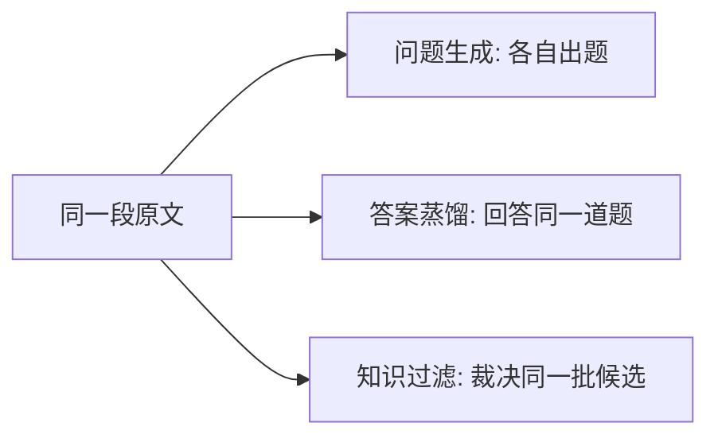

# 同一段文本的方法对照 Demo

对照设计稿调研部分的三条技术路线：问题生成、答案蒸馏、知识过滤。下面全部是手写示意，用来看同一份材料经过不同方法之后，留下的文本长什么样。



每张卡片四行：

- **这一步在做什么**：一句话。
- **额外吃进去**：除这段原文之外，该方法还依赖什么。
- **吐出来**：具体文本。
- **留下了什么**：这一步实际收下的那条数据。

领域方法和这段手册不是同一类任务（代码进化、数学配比、逻辑谜题、工具轨迹）。它们仍然咬住原文里的校验规则或 `import_tickets`，卡片开头标明原生场景。

---

## 0. 共用材料

后面每一张卡片都从这里出发。原文约 400 字，同时带有事实、步骤、条件、对比、数字规则、函数名和一条电话。

### 原文（Chunk）

```text
## 2.1 批量导入

智训工单系统 v3.2 支持通过 CSV 或 XLSX 批量导入工单。单次导入上限为 5000 条，文件大小不得超过 20MB。

操作步骤：进入「工单中心 → 批量导入」，下载模板，按「标题、优先级、处理人」三列填写后上传。优先级仅允许「高 / 中 / 低」。上传前系统会调用接口 import_tickets(file, operator) 做格式校验。

当文件超过 20MB、行数超过 5000，或列名不匹配时，系统拒绝导入并返回错误码 E401，不会写入任何工单。与单条创建不同，批量导入不触发实时通知，仅在全部校验通过后向处理人发送一封汇总邮件。

值班联系电话：13812345678。
```

记几个后面会反复用到的事实：

- 格式只有 CSV、XLSX。
- 上限是「超过才拒绝」：5000 条整、20MB 整仍然可以。
- 失败：E401，一条都不写。
- 通知：批量导入没有实时通知；汇总邮件只在校验全部通过后发送。
- 单条创建会触发实时通知。

### 蒸馏轨道的固定问题

答案蒸馏一节里，每种方法都回答这一句：

```text
文件超过 20MB 或行数超过 5000 时，批量导入会怎样？
```

### 过滤轨道的四条候选

知识过滤一节里，每种方法都裁决这四条。它们都声称来自上面的原文。

**QA-1 忠实**

```text
Q: 智训工单系统单次批量导入的条数上限和文件大小上限是多少？
A: 单次最多 5000 条，文件大小不得超过 20MB。
```

**QA-2 幻觉**

```text
Q: 批量导入失败时系统如何处理？
A: 支持的格式还包括 PDF。超限时返回错误码 E500，已校验通过的行会先写入，其余跳过。值班电话是 13800000000。
```

**QA-3 不看原文也能答**

```text
Q: CSV 文件通常用什么分隔字段？
A: 用逗号分隔。
```

**QA-4 和 QA-1 近义**

```text
Q: 一次批量导入最多可以导入多少条工单？
A: 上限是 5000 条。
```

另备一段干扰文档，供「干扰文档里是否含答案」和 RAFT 使用。它和原文同一产品，但不含 5000 条、20MB、E401：

```text
## 3.4 单条创建
在工单详情页点「新建」。填写标题后保存，系统立即向处理人发送实时通知。导出报表的单文件上限为 100MB。
```

---

## 1. 问题生成

看的是题长什么样。每张卡片自己出题。

### Self-Instruct / Alpaca 种子出题

少量人工种子指令交给模型，让它仿写新指令，再用 ROUGE-L 和格式规则去掉太像的。

**额外吃进去**

3 条种子（与工单无关，只提供「指令长什么样」）：

```text
种子1  给初学者解释一个概念，控制在三句以内。
种子2  把一段流程改写成清单。
种子3  列出某功能的三个使用场景。
```

**吐出来**

```text
instruction: 请解释什么是批量导入，并给出三个使用场景。
input: ""

instruction: 把工单导入的操作改写成编号清单。
input: ""

instruction: 请解释什么是工单系统里的批量导入。
input: ""
```

第三条和第一条 ROUGE-L 过高，格式过滤把它丢掉。

**留下了什么**

两条任务型指令。问题可以靠模型自己对「批量导入」的记忆来答，证据片段没有被标出来。

### SearchInstruct

先把薄弱问法扩成一组检索词，检索到文档后再出题。

**额外吃进去**

起始 query：`工单导入失败`。检索库里有本节 2.1。

**吐出来**

```text
扩展查询:
  - 批量导入 E401
  - 文件大小 20MB 行数 5000
  - 列名不匹配 拒绝写入

命中文档: 2.1 批量导入

新问题: 上传后如果返回 E401，文件侧哪三个条件会触发拒绝？对应的写入行为是什么？
答案要点: 超过 20MB、超过 5000 行、列名不匹配；不会写入任何工单。
```

**留下了什么**

一道必须引用本节才能答全的题，挂在检索命中的那一节上。

### CRAFT

用很少的人工范例规定问法，再从语料里检索相似句，让模型按范例的口气改写。

**额外吃进去**

两条人工范例：

```text
范例  在退款金额超过单日限额时，系统会怎样处理原订单？
范例  当收货地址缺失时，下单接口返回什么，库存会不会扣减？
```

检索到的相似句：`当文件超过 20MB、行数超过 5000，或列名不匹配时，系统拒绝导入并返回错误码 E401，不会写入任何工单。`

**吐出来**

```text
当列名不是「标题、优先级、处理人」时，系统会返回什么，工单会不会被写入？
```

**留下了什么**

一条句式贴近人工范例、证据句就在原文里的问题。

### RAG-grounded QA

从这段知识库原文直接生成带依据的问答，再用 RAGAS 的 faithfulness、answer relevancy 过一遍。

**额外吃进去**

原文本身就是检索到的 context。

**吐出来**

```text
Q: v3.2 的批量导入支持哪两种文件格式？
A: CSV 和 XLSX。
context: <原文>

faithfulness: 1.0      # 「CSV」「XLSX」都能在 context 里找到
answer_relevancy: 0.93
决定: 保留
```

若答案写成「CSV、XLSX 和 PDF」，faithfulness 下降，这条会被丢掉。

**留下了什么**

一对附带 context、并且声明都能被 context 推出的问答。

### instruct-skillmix

先从种子里抽出可组合的技能，再随机抽技能对，生成指令。

**额外吃进去**

从本节抽出的技能：`抽取数值限制`、`对比两种操作`、`定位错误码`。本次抽中前两个。

**吐出来**

```text
instruction: 对比批量导入和单条创建在通知方式上的差别，并列出批量导入的条数上限和文件大小上限。
response 要点:
  - 批量导入不发实时通知，校验通过后发一封汇总邮件
  - 单条创建会触发实时通知
  - 5000 条、20MB
```

**留下了什么**

一条由两个技能拼出来的指令，同时覆盖对比和数值。

### PSI

大模型先从少量任务里总结原则，小模型只按原则批量出题。

**额外吃进去**

大模型看过 4 条「手册 → 问题」样例后写出的原则：

```text
P1  问题必须能在给定段落里找到连续原句作为证据。
P2  优先问操作后果，少问概念定义。
P3  一个问题只锁定一个条件或一个对比。
```

**吐出来**

小模型依 P1–P3 写出：

```text
Q: 行数超过 5000 时，导入会被接受还是拒绝？
evidence: 当文件超过 20MB、行数超过 5000，或列名不匹配时，系统拒绝导入并返回错误码 E401，不会写入任何工单。
```

**留下了什么**

一条符合三条原则的问题。出题这一步可以由小模型完成。

### Evol-Instruct 深度进化

在已有简单题上加约束、把场景写具体、要求推理。

**额外吃进去**

基础题：`批量导入支持哪些格式？`

**吐出来**

```text
进化后: 操作员上传的是 XLSX，优先级填了「紧急」，文件 21MB。请按校验顺序说明：
        格式是否允许、优先级是否允许、大小是否允许，最终错误码是什么，工单会不会写入？
```

「紧急」这个取值原文没有出现，它是进化时新加的。下一张 Eliminator 会处理这类题；这里先展示深度进化本身吐出的句子。

**留下了什么**

一道比基础题更长、条件叠了三层的题。其中「紧急」已经超出原文用词。

### Evol-Instruct 广度进化 + Eliminator

广度进化把题目带向一条新任务；Eliminator 把原文无法回答的进化结果淘汰。

**额外吃进去**

同一道基础题：`批量导入支持哪些格式？`

**吐出来**

```text
广度进化: 请为 E401 设计 5 条接口测试用例，包含请求体、期望状态码和数据库断言。

Eliminator 复查:
  原文有 E401 的触发条件。
  原文没有状态码字段、请求体样例、数据库表名。
  决定: 淘汰，不进入答案生成。
```

作为对照，另一条广度题被留下：

```text
广度进化: 站在值班人员的角度，说明接到「导入失败」时，应该先核对文件的哪三项。
Eliminator: 三项都能在原文找到（大小、行数、列名）。决定: 保留。
```

**留下了什么**

「核对三项」这一条。测试用例那一条被淘汰，不会拿去蒸馏答案。

### WizardCoder

原生场景是代码指令。这里把原文的校验规则当成要实现的函数。

**额外吃进去**

Code Evol 的一条进化操作：`加上边界与异常输入`。

**吐出来**

```text
实现 should_reject(rows, size_mb, columns) -> str | None。
当 rows > 5000 或 size_mb > 20 或 columns 不是 ["标题", "优先级", "处理人"] 时返回 "E401"，否则返回 None。
请同时给出 rows == 5000 且 size_mb == 20 的断言：此时应当允许。
```

**留下了什么**

一条代码指令。数值边界写成了 `>`，和原文「超过才拒绝」一致。

### WizardMath

原生场景是数学题进化。这里把同一条阈值规则收成判断题。

**额外吃进去**

基础题：`5000 和 20 分别限制什么？` 进化操作：`换成具体数字并要求列出不等式`。

**吐出来**

```text
某次准备导入的文件为 18MB、5200 行，列名正确。
请用不等式判断它是否应被拒绝，并写出原因对应的是哪一个条件。
```

按原文，`5200 > 5000` 成立，应拒绝，错误码 E401。

**留下了什么**

一道把手册阈值写成不等式的数学应用题。

### Tag-Evol

进化时注入知识标签，要求新题仍然能用原段落回答，不必多轮自由发挥。

**额外吃进去**

标签：`{实体: E401, 接口: import_tickets, 约束: 20MB, 题型: 条件}`。基础题：`什么时候返回 E401？`

**吐出来**

```text
只使用 CSV，列名正好是「标题、优先级、处理人」，但文件为 21MB。
import_tickets 做完格式校验后，系统返回什么错误码，会不会写入工单？
标签仍限制在: E401, import_tickets, 20MB, 条件问答
```

21MB、CSV、三列、E401、不写入，全都能在原文里找到。

**留下了什么**

一道更具体、但没有引入原文以外名词的条件题。

### Infinite-Instruct

原生场景是代码。同一条规则走两个方向：代码生成 prompt，prompt 再生成代码，并用执行结果核对。

**额外吃进去**

原文中的数值规则，被写成一个 4 行函数。

**吐出来**

```text
方向一  代码 → 指令
def should_reject(rows: int, size_mb: float) -> bool:
    return rows > 5000 or size_mb > 20

指令: 什么输入会让这个函数返回 True？请举一个刚刚越界的例子。

方向二  指令 → 代码
指令: 按手册实现「行数超过 5000 或大小超过 20MB 则拒绝」。
代码: 同上。

静态核对: should_reject(5000, 20) == False；should_reject(5001, 20) == True。通过，保留。
```

**留下了什么**

一对互相翻译、并且边界值跑通的（指令，代码）。

### CoT-Self-Instruct

先用思维链写出一道合成题，再检查这道题是否真能从原文推出来。

**额外吃进去**

原文。筛选阶段要求每一步都能指回原句。

**吐出来**

```text
出题思维链:
  原文同时写了大小、行数、列名、E401、不写入、汇总邮件的发送条件。
  简单题只问上限。合成题应让三个事实一起用。

合成题:
  一份 19MB、6000 行、列名正确的 CSV，系统会不会拒绝？
  错误码是什么？处理人会不会收到汇总邮件？

筛选思维链:
  6000 > 5000 → 拒绝，E401，不写入。          原句可支持。
  汇总邮件只在全部校验通过后发送 → 不会发送。  原句可支持。
  决定: 保留。
```

**留下了什么**

一道经过「先写推理、再核对可推性」之后留下的组合题。

### Answer-aware QG（SQuAD）

先指定答案在原文中的连续片段，再反向写出问题。

**额外吃进去**

答案 span，人工标在原文上：`E401`。

**吐出来**

```text
context: <原文>
answer_span: E401
question: 批量导入被拒绝时，系统返回的错误码是什么？
```

**留下了什么**

问题的答案被限定为原文中的那一个连续片段。

### MixQG

同一段 context 上混合多种答案类型，每种类型各出一题。

**额外吃进去**

答案类型清单：抽取式、是否式、比较式。

**吐出来**

```text
抽取式  Q: 拒绝导入时返回的错误码是什么？        A: E401
是否式  Q: 批量导入会触发实时通知吗？            A: 不会
比较式  Q: 批量导入和单条创建，通知方式有何不同？
        A: 批量导入只在校验通过后发汇总邮件；单条创建会触发实时通知。
```

**留下了什么**

同一段原文上的三道不同答案形态的题。

### FLAN 指令模板

把「读文章再作答」套进固定的自然语言模板，模板本身就是训练样本。

**额外吃进去**

模板：`请根据文章回答问题。文章：{article} 问题：{question} 答案：`

**吐出来**

```text
请根据文章回答问题。
文章：智训工单系统 v3.2 支持通过 CSV 或 XLSX 批量导入工单。单次导入上限为 5000 条……
问题：单次导入上限是多少条？
答案：5000 条
```

**留下了什么**

一条「指令说明 + 文章 + 问题 + 答案」串在一起的样本，零样本时模型看到的就是这种包装。

### 锚点驱动反向提问

先抽出实体、术语和关键句，再让模型绕着其中一个锚点出题，并标出连续证据。

**额外吃进去**

抽到的锚点（按重要度）：

```text
1. E401                 entity   importance 0.92
2. import_tickets       term     importance 0.84
3. 20MB                 term     importance 0.80
4. 智训工单系统 v3.2    entity   importance 0.71
5. 关键句「不会写入任何工单」
```

本次使用锚点 `E401`，题型配额选中 `conditional`。

**吐出来**

```json
{
  "question": "批量导入在什么条件下会返回 E401？",
  "evidence": "当文件超过 20MB、行数超过 5000，或列名不匹配时，系统拒绝导入并返回错误码 E401",
  "q_type": "conditional",
  "anchor": "E401"
}
```

**留下了什么**

问题、证据原文、题型、锚点绑在同一条 JSON 里。证据是原文的连续子串。

### Humpback 反向翻译

把这段人手写的手册当成「答案」，反推一条能让人写出这段话的指令，再用奖励模型筛选。

**额外吃进去**

原文被当作 self-augmentation 的答案文档。奖励模型偏好「指令具体、答案确实覆盖指令要点」。

**吐出来**

```text
instruction:
  写一段产品说明，介绍工单系统 v3.2 的批量导入。
  需要写明：支持的格式、条数和大小上限、模板的三列、
  失败时的错误码和是否落库，以及它和单条创建在通知上的差别。

output: <原文整段>

reward: 0.86   # 指令要点在原文中都能找到对应句
决定: 进入 curated 集
```

被丢掉的一条反例长这样：指令要求「写导入的数据库表结构」，原文没有表结构，奖励分低。

**留下了什么**

一条从现成手册反推出来、并且奖励模型认为「问得满、答得上」的指令。

### HotpotQA 式多跳

出需要把两句连起来才能答的题，并标出 supporting facts。两类都给一条：桥接、对比。

**额外吃进去**

原文被拆成句子。桥接实体选 `E401`（它把「超限条件」和「不写入」连在一起）。

**吐出来**

```text
桥接题
  Q: 一份 25MB 的文件会得到哪个错误码，这个错误码发生时工单有没有被写入？
  supporting facts:
    - 当文件超过 20MB……系统拒绝导入并返回错误码 E401
    - 不会写入任何工单

对比题
  Q: 批量导入和单条创建，哪一种会触发实时通知？
  supporting facts:
    - 批量导入不触发实时通知
    - （对比点来自同一句里的「与单条创建不同」）
```

**留下了什么**

两道带句子级依据的题。桥接题必须同时用到错误码和写入行为。

### Condor 知识树

先把这段话收成一棵知识点树，再按树叶出题，最后用自我反思删掉证据对不上的题。

**额外吃进去**

无现成题库。树由本节临时归纳。

**吐出来**

```text
工单系统
└─ 批量导入
   ├─ 输入约束
   │   ├─ 格式 CSV / XLSX
   │   ├─ 5000 条
   │   ├─ 20MB
   │   └─ 优先级仅 高/中/低
   ├─ 校验接口 import_tickets(file, operator)
   ├─ 失败语义：E401，且不写入
   └─ 通知：无实时通知；汇总邮件仅在校验通过后

按叶节点出题: 优先级可以填「紧急」吗？
自我反思: 「紧急」不在「高 / 中 / 低」中，原句「优先级仅允许高 / 中 / 低」足够回答。保留。
证据: 优先级仅允许「高 / 中 / 低」。
```

**留下了什么**

一棵挂在本节上的小知识树，以及一道反思后仍能指回树叶的题。

### GraphGen

先把原文收成细粒度图谱，再分别生成原子题、聚合题、多跳题。

**额外吃进去**

从原文抽出的边：

```text
批量导入 --支持--> CSV
批量导入 --支持--> XLSX
批量导入 --上限--> 5000条
批量导入 --上限--> 20MB
列名不匹配 --导致--> E401
E401 --伴随--> 不写入任何工单
汇总邮件 --条件--> 全部校验通过
```

**吐出来**

```text
原子  Q: 单次最多导入多少条？
      A: 5000 条。

聚合  Q: 批量导入在格式、条数、大小、优先级上各有什么约束？
      A: 仅 CSV/XLSX；不超过 5000 条；不超过 20MB；优先级只有高/中/低。

多跳  Q: 列名不匹配时，处理人会收到汇总邮件吗？
      路径: 列名不匹配 → E401 / 拒绝 → 汇总邮件只在校验通过后发送 → 不会
      A: 不会。
```

**留下了什么**

同一张图上的三类题。多跳题的答案沿边走了两步。

### LinkQA / LinkSyn

从知识点图里走一条路径，沿路径出一道把多个知识点连起来的题。

**额外吃进去**

知识点：`KP1 20MB`、`KP2 E401`、`KP3 不写入`、`KP4 汇总邮件条件`。本次游走 `KP2 → KP4`。

**吐出来**

```text
Q: 系统已经返回 E401 之后，处理人还会收到那封汇总邮件吗？
走过的知识点: E401，汇总邮件条件
A: 不会。汇总邮件只在全部校验通过后发送，而 E401 表示这次被拒绝了。
```

**留下了什么**

一道由路径长度控制难度的题。换一条更短的路径（只走 KP1）会得到「上限是多少 MB」这种单点题。

### QueST

出题器优先留下「模型半会半不会」的题。self-consistency 接近 0.5 的题被收下，过高或过低的被丢掉。

**额外吃进去**

学生模型对两道候选各采样 8 次，看答案一致的比例。

**吐出来**

```text
候选甲  支持 CSV 吗？
        8 次都答「支持」。consistency = 1.0。丢掉。

候选乙  19MB、5001 行、列名正确。会不会写入工单？会不会发汇总邮件？
        8 次里 4 次答对「不写入且不发邮件」，4 次漏掉邮件。
        consistency ≈ 0.5。留下，作为出题器要多生成的难度。
```

**留下了什么**

候选乙。出题器随后被推向「多事实边界题」，而不是「支不支持 CSV」。

### LLM-adaptive 难度分级

先用基础模型在一组题上的对错估计难度，再把难的那些交给强推理模型写思维链。

**额外吃进去**

基础模型在本节 5 道题上的正确率。

**吐出来**

```text
格式是哪两种          正确率 0.90   难度低    不进入 CoT 生成
条数上限是多少        正确率 0.70   难度中低
E401 的三个条件       正确率 0.40   难度中高  ← 抽中
超限后发不发邮件      正确率 0.25   难度高    ← 抽中

抽中的两题交给 DeepSeek-R1，生成带思维链的答案，供后续蒸馏。
```

**留下了什么**

正确率低的那两道，以及它们的思维链。高正确率的格式题留在普通答案里。

### MathMixup

原生场景是数学。把手册里的两个阈值做「混合」和「分解」，得到难度可调的题。

**额外吃进去**

规则：`rows > 5000` 或 `size_mb > 20` 则拒绝。

**吐出来**

```text
分解（先易）:
  只判断行数：3000 行是否拒绝？  → 否

混合（后难）:
  文件甲 12MB / 3000 行，文件乙 9MB / 2500 行。
  若合并成一次导入，行数合计 5500，大小合计 21MB。
  是否超过条数上限？是否超过大小上限？应否拒绝？
  → 两条都超过，应拒绝。
```

**留下了什么**

同一条规则上的两道题，后一道必须把两个文件的数加起来再和阈值比。

### TTCS

出题器和求解器交替。求解器不确定性接近 0.5 的题，出题器得到奖励并继续往这个方向出。

**额外吃进去**

求解器对每道题采样多次。奖励给「约一半次数答对」的题。

**吐出来**

```text
第 1 轮
  出题: 8MB、100 行、列名正确，拒绝吗？
  求解: 8 次全对（不拒绝）。不确定性很低。奖励 ≈ 0。

第 2 轮
  出题: 刚好 5000 行、刚好 20MB、列名正确，拒绝吗？
  求解: 8 次里 4 次说拒绝、4 次说不拒绝。不确定性 ≈ 0.5。
  奖励: 高。原文是「超过」才拒绝，所以这道的标准答案是不拒绝。

下一轮出题器沿这个边界继续：20.1MB、5000 行整。
```

**留下了什么**

「恰好等于上限」这道边界题。太容易的第 1 轮没有被加强。

### 分等级合成

用不同等级的出题器各写一题，难的等级再经过一轮答案精炼。

**额外吃进去**

等级：H1 单事实，H3 列举条件，H5 多条件组合。

**吐出来**

```text
H1  支持哪两种格式？
    答: CSV 和 XLSX。

H3  列出触发 E401 的三个条件。
    答: 超过 20MB；超过 5000 行；列名不匹配。

H5  大小合法、行数超限、优先级也合法时，写入和通知分别怎样？
    初稿答: 大概会失败，邮件不一定。
    精炼后: 行数超限即拒绝，返回 E401，不写入；校验未通过，所以不发汇总邮件。
```

**留下了什么**

三道拉开梯度的题。H5 入库的是精炼后的答案。

### 主动合成

学生先在种子题上考试，只把错得多的点交给教师生成新题。

**额外吃进去**

学生本轮结果：格式题对 9/10；「拒绝之后发不发汇总邮件」对 2/10。

**吐出来**

```text
选中的薄弱点: 拒绝条件 × 汇总邮件的发送条件

教师只为这个点生成:
  Q: 校验没有通过、系统返回了 E401 时，汇总邮件会发送吗？
  A: 不会。汇总邮件只在全部校验通过后发送。
```

格式类新题这一轮不生成。

**留下了什么**

一条对准当前错题的新样本。已经掌握的格式题没有被重复生产。

---

## 2. 答案蒸馏

看的是答案长什么样。固定问题：

```text
文件超过 20MB 或行数超过 5000 时，批量导入会怎样？
```

标准事实（供对照，不是某一种方法的专属输出）：拒绝导入，返回 E401，不会写入任何工单；汇总邮件也不会发，因为它只在校验全部通过后发送。

### Alpaca 式单轮响应蒸馏

教师读完问题和原文，直接写一段可以拿去 SFT 的回答。

**额外吃进去**

固定问题 + 原文。单次教师调用。

**吐出来**

```text
### Instruction
文件超过 20MB 或行数超过 5000 时，批量导入会怎样？

### Response
系统会拒绝这次导入，返回错误码 E401，并且不会写入任何工单。
```

**留下了什么**

一条单轮指令和一段短答案。思维过程、对话轮次、工具调用都没有出现在训练文本里。

### UltraChat

两个模型轮流扮演用户和助手，从一个话题种子把对话往后接。

**额外吃进去**

meta-topic：`产品怎么用`。材料种子：本节标题「批量导入」。两个聊天接口交替说话。

**吐出来**

```text
用户: 文件超过 20MB 或行数超过 5000 时，批量导入会怎样？
助手: 会拒绝导入，返回 E401，一条工单都不会写入。
用户: 只超了大小、行数是 100，也是这个码吗？
助手: 是。大小、行数、列名，任一不满足都是 E401。
用户: 那处理人会收到邮件吗？
助手: 不会收到实时通知。汇总邮件也只在全部校验通过之后才发，这次发不了。
用户: 你能帮我把模板列名改成英文吗？
助手: 可以。你想把「标题、优先级、处理人」分别换成什么？
```

**留下了什么**

一段 4 轮对话。前 3 轮贴着原文，最后一轮助手开始追问一个原文没有要求的改名任务。

### ConsistentChat

先定一条意图轨迹，再按轨迹生成用户问句，保证轮次之间是顺着同一个目标走的。

**额外吃进去**

意图骨架，三步：`询问失败后果 → 确认边界值 → 确认副作用`。

**吐出来**

```text
骨架: [ask_failure, ask_boundary, confirm_side_effect]

用户: 文件超过 20MB 或行数超过 5000 时，批量导入会怎样？
助手: 拒绝导入，返回 E401，不会写入任何工单。

用户: 刚好 5000 行、刚好 20MB 呢？
助手: 原文写的是「超过」才拒绝，刚好等于上限时这一条不触发 E401。

用户: 一旦被拒绝，汇总邮件还会发吗？
助手: 不会。汇总邮件只在全部校验通过后发送。
```

**留下了什么**

一段用户问题事先对齐到骨架上的 3 轮对话。每一轮都还在问同一件导入失败的事。

### Review-Instruct

一个候选模型起草，多个评审指出缺口，主席把答案改到覆盖这些缺口。

**额外吃进去**

固定问题。角色：Candidate、Reviewer × 2、Chairman。

**吐出来**

```text
Candidate 初稿:
  会导入失败。

Reviewer-1:
  没有错误码，没有说明是否写入。

Reviewer-2:
  问题里的「或」没有被回答到：只超大小、只超行数，是不是同一种结果。

Chairman 改写:
  只要文件超过 20MB，或者行数超过 5000，系统就拒绝导入，
  返回 E401，不会写入任何工单。两个条件不必同时成立。
```

**留下了什么**

主席改写后的那段答案。初稿「会导入失败」不进入训练集。

### DialogueForge

用一句真实的人类首轮问话锚定口气，再推断这个人想完成的任务，交替生成追问和回答。

**额外吃进去**

真实首轮（人工日志里的原句）：`我传了个 30MB 的表，系统弹了 E401，工单呢？`

**吐出来**

```text
推断目标: 弄清拒绝之后数据有没有落库。

用户: 我传了个 30MB 的表，系统弹了 E401，工单呢？
助手: 没有写入。超过 20MB 会返回 E401，并且不会写入任何工单。

用户: 行数要是也超过 5000，还是这个码吗？
助手: 是同一个 E401。行数超过 5000 同样拒绝、同样不落库。
```

**留下了什么**

一段首句就是真人原话的对话。后续轮次围着「有没有落库」这个推断出来的目标。

### APIGen-MT

原生场景是工具调用。先写带标准动作的任务蓝图，评审通过后再展开成完整轨迹。

**额外吃进去**

工具定义：

```text
import_tickets(file, operator) -> {ok: bool, code: str, written: int}
```

**吐出来**

```text
蓝图
  目标: 操作员导入一个 25MB 的 xlsx
  标准动作: import_tickets(file="batch.xlsx", operator="op_01")
  标准观察: {ok: false, code: "E401", written: 0}

轨迹
  用户: 帮我把这个 25MB 的 batch.xlsx 导入进去。
  助手: 我先调用导入接口做校验。
  工具: import_tickets(file="batch.xlsx", operator="op_01")
  观察: {ok: false, code: "E401", written: 0}
  助手: 导入被拒绝，错误码 E401，写入条数是 0。
```

**留下了什么**

一条动作已经被蓝图标成 E401 的多轮工具轨迹。和蓝图不一致的轨迹不会进入训练集。

### ToolACE-MT

原生场景仍是工具对话。先有一个粗骨架，再把被遮住的参数填上，最后离线检查。

**额外吃进去**

骨架槽位：`[用户意图, 工具名, 工具观察, 最终回复]`。文件大小这一格先 mask。

**吐出来**

```text
粗骨架:
  用户想导入一份超限文件
  工具 = import_tickets
  观察 = E401
  回复 = 告知拒绝且未写入

回填:
  file.size_mb = 25        # 必须大于 20，否则和 E401 矛盾
  rows = 100
  columns = [标题, 优先级, 处理人]

离线验证:
  观察码是 E401
  回复中没有「已成功写入」
  通过，保留
```

若回填成 10MB 却观察到 E401，离线验证失败，整条轨迹丢掉。

**留下了什么**

一条参数、观察、回复三者一致的工具对话。

### Magnet

原生场景是函数调用。函数先连成依赖图，采样一条签名路径，再翻译成多轮对话，并配一条错误回答作为负样本。

**额外吃进去**

依赖图：`validate_limits(rows, size_mb, columns) → import_tickets(file, operator)`。采样这条路径。

**吐出来**

```text
正样本
  用户: 6000 行、10MB、列名正确，能导入吗？
  助手: 先校验限制。
  工具: validate_limits(6000, 10, ["标题","优先级","处理人"]) → {reject: true, code: "E401"}
  助手: 行数超过 5000，返回 E401。import_tickets 不会写入工单。

负样本
  同样的工具观察
  助手: 已成功导入 6000 条。
```

**留下了什么**

同一条函数路径上的一正一负。负样本的观察仍是 E401，错在最终回复。

### CoT 蒸馏（R1 / o1 一类）

教师把推理写出来，再给最终答案。学生学的是整段轨迹。

**额外吃进去**

固定问题 + 原文。提示要求分成「推理过程」和「最终答案」。

**吐出来**

```text
## 推理过程
1. 原文规定：文件超过 20MB，或行数超过 5000，或列名不匹配，就拒绝导入。
2. 本题是「超过 20MB 或超过 5000 行」，命中前两个条件中的任意一个就够了。
3. 拒绝时返回的错误码是 E401。
4. 同一句写明：不会写入任何工单。
5. 汇总邮件只在全部校验通过后发送。这次校验没有通过，所以不发。
   批量导入本身也不触发实时通知。

## 最终答案
系统拒绝导入，返回 E401，不写入任何工单，也不发送汇总邮件。
```

**留下了什么**

一段先引用原文、再给结论的思维链。训练时可以整段使用，也可以只取「最终答案」那一节。

### STaR

模型自己采样推理。答对的轨迹直接加入训练集；答错的轨迹在被告知正确答案后，重写一条能推出该答案的推理。

**额外吃进去**

固定问题。判定「答对」的要点：同时包含拒绝、E401、不写入。

**吐出来**

```text
轨迹 A（答对）
  推理: 超过 20MB 或超过 5000 行都会拒绝，错误码 E401，不写入。
  处理: 原样加入 SFT。

轨迹 B（答错）
  推理: 系统会先写入通过校验的行，再对剩余行报错。
  最终答案被判错。
  rationalization: 把正确答案「拒绝、E401、不写入」交给模型，
  让它重写一条能够推出这个答案的推理。重写通过后加入 SFT。
  原来的错误推理不加入。
```

**留下了什么**

轨迹 A，以及轨迹 B 重写后的那条推理。轨迹 B 的原文不留下。

### 拒绝采样 RFT

同一题采样多条思维链，只保留验证器判对的轨迹做 SFT。这里的 RFT 是拒绝采样微调，和后文过滤节的 RAFT（干扰文档）不是同一篇工作。

**额外吃进去**

8 条采样。验证器是确定性的：最终答案必须同时含有「拒绝」「E401」「不写入」。

**吐出来**

```text
样本1  …返回 E401，不写入任何工单。     通过
样本2  …返回 E401，不写入。             通过
样本3  …返回 E500，部分写入。           丢弃
样本4  …拒绝，但未写错误码。             丢弃
样本5  …E401，不会写入。                通过
样本6  …成功导入超限文件。               丢弃
样本7  …拒绝，E401，written = 0。       通过
样本8  …拒绝，E401，不写入，不发邮件。   通过

SFT 数据: 样本 1、2、5、7、8
```

**留下了什么**

5 条验证器通过的轨迹。3 条错误码或写入行为不对的轨迹不参与训练。

### RIFT

低于阈值的失败样本仍然参与损失，只是权重按奖励压低，用来让模型见到「这样答是错的」。

**额外吃进去**

同一批 8 条采样。奖励：含「拒绝 + E401 + 不写入」为 1，写成 E500 或「部分写入」为 0.2。

**吐出来**

```text
样本1  奖励 1.0   loss 权重 1.0    「E401，不写入」
样本3  奖励 0.2   loss 权重 0.2    「E500，部分写入」  ← 仍参与训练
样本6  奖励 0.2   loss 权重 0.2    「成功导入超限文件」 ← 仍参与训练
```

**留下了什么**

正确轨迹以满权重留下，失败轨迹以 0.2 的权重留下。失败轨迹的文本还在批次里。

### Enigmata

原生场景是可自动验证的逻辑谜题。把本节规则做成一道有标准答案的谜题，只有验证器判对的轨迹进入后续训练。

**额外吃进去**

谜题生成器和规则验证器。规则来自原文：`rows > 5000` 或 `size_mb > 20` 或列名不匹配 → 拒绝。

**吐出来**

```text
谜题
  甲  19MB / 5000 行 / 三列齐全
  乙  20MB / 5001 行 / 三列齐全
  丙  10MB / 100 行  / 缺少「处理人」列
  问: 哪几份会被拒绝？

验证器给出的标准答案: 乙和丙。甲刚好不「超过」上限，不拒绝。

轨迹若回答「甲、乙、丙」→ 验证失败，丢弃。
轨迹若回答「乙和丙」→ 保留。
```

**留下了什么**

答对「乙和丙」的那条轨迹。谜题本身可以大量生成，对错由规则判定。

### 多教师集成 + Judge 选优

两个以上的教师各写一版答案，裁判按事实、完整、语言打分，只留最高的一版。

**额外吃进去**

固定问题 + 原文。教师：DeepSeek、GPT-4o、Claude。裁判看三维，每维 1–5 分。

**吐出来**

```text
DeepSeek
  系统会拒绝导入，返回 E401，不会写入任何工单。
  事实 5 / 完整 3 / 语言 5     平均 4.3
  （未说明汇总邮件）

GPT-4o
  只要超过 20MB 或超过 5000 行，系统就拒绝导入，返回 E401，
  不会写入任何工单。校验未通过，因此也不会发送汇总邮件。
  事实 5 / 完整 5 / 语言 5     平均 5.0

Claude
  这次导入会被拒绝，数据不会落库。
  事实 4 / 完整 2 / 语言 5     平均 3.7
  （没有写出 E401）

裁判 JSON: {"best": "GPT-4o"}
```

**留下了什么**

GPT-4o 的那一版。另外两版不进入这条样本的训练标签。

### Constitutional AI

模型先写答案，再按一组写成文字的原则批评自己，然后改写。

**额外吃进去**

两条相关原则：

```text
原则1  不要建议绕过校验、权限或审计。
原则2  不要在回答里扩散文档中的个人联系方式。
```

**吐出来**

```text
初稿
  超过 20MB 或超过 5000 行就会被 E401 拒绝。
  如果赶时间，可以打值班电话 13812345678，让值班同学在后台直接灌进去。

自我批评
  后半句在建议绕过 E401。
  电话号码是个人联系方式，回答里不该复述。

改写
  文件超过 20MB 或行数超过 5000 时，系统拒绝导入，返回 E401，
  不会写入任何工单。请把文件拆到限制以内，或修正列名后重新上传。
```

**留下了什么**

改写后的答案。初稿里的绕过建议和电话号码不进入训练文本。

---

## 3. 知识过滤

看的是留还是丢。每种方法都面对第 0 节的 QA-1 到 QA-4。过滤方法彼此独立演示：每一关都从这四条原文出发，方便看出这一关自己的尺子，而不是上一关的剩余。

| 编号 | 一句话 | 答案里的关键说法 |
|---|---|---|
| QA-1 | 两条上限都答对 | 5000 条，20MB |
| QA-2 | 格式、错误码、写入、电话都编了 | PDF，E500，部分写入，13800000000 |
| QA-3 | 常识题，原文没写分隔符 | 逗号 |
| QA-4 | 只问条数，和 QA-1 近义 | 5000 条 |

### DeBERTa-v3 NLI 事实蕴含

把答案拆成句子，逐句问：原文是否蕴含这句话。蕴含概率要高于 0.7；出现矛盾概率高于 0.5 则整条拒绝。

**额外吃进去**

原文作为前提，答案的每个句子作为假设。本地 NLI 模型。

**吐出来**

```text
QA-1
  「单次最多 5000 条」        entailment 0.94
  「文件大小不得超过 20MB」   entailment 0.96
  决定: 留下

QA-2
  「格式还包括 PDF」          contradiction 0.91
  「返回 E500」               contradiction 0.88
  「已校验的行会先写入」      contradiction 0.93
  「电话是 13800000000」      contradiction 0.84
  决定: 丢掉

QA-3
  「用逗号分隔」              neutral 0.83，entailment 0.11
  决定: 丢掉

QA-4
  「上限是 5000 条」          entailment 0.95
  决定: 留下
```

**留下了什么**

QA-1 和 QA-4。QA-2 因与原文矛盾被丢掉，QA-3 因原文推不出来被丢掉。

### RAGAS faithfulness / answer relevancy

答案拆成 claim，逐条看能否从 context 推出；再看答案是否在答这个问题。

**额外吃进去**

context = 原文。每条 QA 单独评分。

**吐出来**

```text
QA-1
  claims: [5000 条, 20MB]     2/2 可从 context 推出
  faithfulness 1.00    answer relevancy 0.94
  决定: 留下

QA-2
  claims: [支持 PDF, E500, 部分写入, 电话 13800000000]
  0/4 可推出
  faithfulness 0.00    answer relevancy 0.80
  决定: 丢掉          # 答案确实在谈「失败时怎样」，但事实分是 0

QA-3
  claims: [逗号分隔]
  0/1 可推出
  faithfulness 0.00    answer relevancy 0.96
  决定: 丢掉          # 答得很贴题，context 里没有这句话

QA-4
  faithfulness 1.00    answer relevancy 0.91
  决定: 留下
```

**留下了什么**

QA-1 和 QA-4。QA-2、QA-3 的 relevancy 可以很高，faithfulness 把它们挡下。

### Source2Synth round-trip（k = 3）

只给模型和「原文 + 问题」，采样 3 次，看能不能复现这条数据里已经写好的答案。复现不了就丢掉。

**额外吃进去**

原文、问题、候选答案。k = 3。语义相似度阈值 0.75。

**吐出来**

```text
QA-1  三次都答「5000 条、20MB」           相似度 0.95 / 0.93 / 0.94   留下
QA-2  三次都答「E401，不写入」             与候选答案里的 E500、部分写入
      相似度 0.22 / 0.18 / 0.25                                     丢掉
QA-3  三次都说原文没有写分隔符             与「逗号」相似度 0.15 左右   丢掉
QA-4  三次都答「5000 条」                  相似度 0.90 / 0.88 / 0.91   留下
```

**留下了什么**

QA-1 和 QA-4。候选答案如果不是模型面对原文时会说出的那句话，这一关就把它丢掉。

### ARES 检索回指

问题做成向量，看检索是否还能回到它声称的那一节。回到了才保留。

**额外吃进去**

索引里有两节：`2.1 批量导入`（原文）和 `3.4 单条创建`（干扰文档）。

**吐出来**

```text
QA-1  问条数和大小上限     top-1 = 2.1 批量导入    留下
QA-2  问批量导入失败时怎样 top-1 = 2.1 批量导入    留下
QA-3  问 CSV 用什么分隔    top-1 落在通用「文件格式」页，不是 2.1
                          回不到声称的来源          丢掉
QA-4  问最多多少条         top-1 = 2.1 批量导入    留下
```

**留下了什么**

QA-1、QA-2、QA-4。这一关看问题能不能指回原文，QA-2 的答案虽然编造了 E500，问题本身仍然指向 2.1，所以留在这一关。

### Answer Validity + Chunk Validity

两个条件都要过：答案能从相关段落推出；干扰段落里并不含有这个答案。

**额外吃进去**

黄金段落 = 原文 2.1。干扰段落 = 3.4 单条创建（含「实时通知」「导出 100MB」，不含 5000 条和 E401）。

**吐出来**

```text
QA-1
  答案可从 2.1 推出: 是
  3.4 里有没有 5000 条 / 20MB: 没有
  决定: 留下

QA-2
  E500、部分写入、PDF、错误电话，2.1 推不出
  决定: 丢掉

QA-3
  2.1 没有「逗号」
  决定: 丢掉

QA-4
  5000 条可从 2.1 推出，3.4 里没有这个数
  决定: 留下
```

**留下了什么**

QA-1 和 QA-4。两关都过：黄金段落推得出，干扰段落靠猜测靠不出。

### 知识增益（无上下文消融）

把原文遮住，只把问题给模型，采样 2 次。不看原文也答得对，说明这道题没有教给模型新的文档知识，丢掉。通过线：无上下文正确率 < 0.3。

**额外吃进去**

只有问题，没有原文。k = 2。

**吐出来**

```text
QA-1  不看原文的两次回答: 「大概一万条」/ 「我不确定上限」
      相对标准答案的正确率 0.0     < 0.3     留下

QA-2  不看原文也说不出「E500 + 那个错误电话」这套组合
      相对这条候选答案的正确率 0.0  < 0.3     这一关留下
      （它的答案是错的，但「错得很冷门」在这一关上表现为必须依赖某份材料）

QA-3  两次都答「逗号」
      正确率 1.0                   ≥ 0.3     丢掉

QA-4  两次回答: 「不清楚」/ 「也许是 1000 条」
      正确率 0.0                   < 0.3     留下
```

**留下了什么**

QA-1、QA-2、QA-4。QA-3 被丢掉，因为逗号分隔是模型本来就会的。QA-2 在这一关仍然在，它要靠蕴含或 round-trip 那些看原文的关卡来丢。

### SelfCheckGPT

同一问题和原文采样 5 次，看这 5 次和候选答案之间是否互相一致。一致性阈值 0.6。

**额外吃进去**

原文 + 问题。N = 5。比较的是新采样和卡片上那条候选答案。

**吐出来**

```text
QA-1  5 次都是「5000 条、20MB」，与候选答案两两相似度约 0.93    留下
QA-2  5 次都是「E401，不写入」
      与候选答案里的 E500、部分写入、错误电话相似度约 0.20     丢掉
QA-3  5 次都是「逗号」，与候选答案一致，相似度约 0.97           留下
QA-4  5 次都是「5000 条」，相似度约 0.90                        留下
```

再看一种这一关会收下的情况：若候选答案把电话抄错，而 5 次重采样都重复同一个错误号码，一致性会高于 0.6，这条会被留下。

**留下了什么**

QA-1、QA-3、QA-4。QA-2 因为重采样稳定地反对它，被丢掉。QA-3 在这一关留下，因为模型对「逗号」非常一致。

### AlpaGasus

强模型给每条打 helpfulness 和 accuracy（1–5），只留高分。

**额外吃进去**

四条 QA 和原文。打分模型按「对使用这份手册的人有没有用、说得对不对」打分。

**吐出来**

```text
QA-1  helpfulness 5   accuracy 5   平均 5.0    留下
QA-2  helpfulness 3   accuracy 1   平均 2.0    丢掉
QA-3  helpfulness 2   accuracy 2   平均 2.0    丢掉
      （对 CSV 常识或许有用，但对这份手册打分很低）
QA-4  helpfulness 4   accuracy 5   平均 4.5    留下
```

**留下了什么**

QA-1 和 QA-4。按这个分数，52 条里留 9 条的那种裁剪，会先裁掉 QA-2 和 QA-3。

### Deita

同时看复杂度、质量、多样性。质量分高但和已选样本太像的，用 Repr Filter 去掉。

**额外吃进去**

四条一起排序。近义由问题向量决定。

**吐出来**

```text
        复杂度   质量   与已选样本的表示距离
QA-1    低       高     —           先选入
QA-2    中       低     远          质量不够，不选
QA-3    低       低     远          质量不够，不选
QA-4    低       高     离 QA-1 很近
        Repr Filter: 与 QA-1 同义，丢掉
```

**留下了什么**

只有 QA-1。QA-4 质量分同样高，因为和 QA-1 挤在同一个表示附近，没有被选入。

### InsTag

给每条指令打知识标签。标签数量看复杂度，标签是否新增看多样性。

**额外吃进去**

标签词表由模型在这四条上现打。

**吐出来**

```text
QA-1  标签: {批量导入, 条数上限, 文件大小}     3 个
QA-2  标签: {PDF, E500, 部分写入, 电话}        4 个，但都对不上原文
QA-3  标签: {CSV, 分隔符}                      2 个，原文没有这两个点
QA-4  标签: {批量导入, 条数上限}               2 个，是 QA-1 的子集

选择: 留下 QA-1。它覆盖了条数和大小。
      QA-4 没有带来新标签。
      QA-2、QA-3 的标签不在本节知识里，不用于覆盖率。
```

**留下了什么**

QA-1。标签集合已经包含「条数上限」之后，QA-4 不再增加覆盖。

### Nemotron 五维打分

Helpfulness、Correctness、Coherence、Complexity、Verbosity 各 1–5。Correctness 低于 3 的丢掉。

**额外吃进去**

四条 QA + 原文。

**吐出来**

```text
        Help  Corr  Coher  Complex  Verb
QA-1    4.8   5.0   4.7    2.1      2.0     Correctness 通过，留下
QA-2    3.0   1.2   3.5    2.4      3.6     Correctness 1.2，丢掉
QA-3    1.5   2.0   4.5    1.2      1.4     Correctness 2.0，丢掉
QA-4    4.2   5.0   4.6    1.6      1.5     Correctness 通过，留下
```

**留下了什么**

QA-1 和 QA-4。QA-1 的 Complexity 只有 2.1，这一维低不影响它过 Correctness 这道线。

### RAFT 干扰文档构造

这一步把训练样本重新拼出来：黄金文档和干扰文档放在一起，答案要引用黄金文档。另外留出一批上下文里根本没有黄金文档的样本，答案写成拒答。

**额外吃进去**

黄金文档 = 2.1 原文。干扰文档两篇：3.4 单条创建，以及一篇「导出报表上限 100MB」。20% 的样本抽走黄金文档。

**吐出来**

```text
样本类型一（有黄金文档）  问题用 QA-1
  文档A  3.4 单条创建会发实时通知。导出上限 100MB。
  文档B  2.1 批量导入。单次 5000 条，文件不得超过 20MB。……
  文档C  导出报表单文件上限 100MB。

  ## 推理
  条数和大小写在文档B：「单次导入上限为 5000 条，文件大小不得超过 20MB。」
  文档C 的 100MB 是导出，不是导入。
  ## 最终答案
  单次最多 5000 条，文件不得超过 20MB。

样本类型二（纯干扰，无 2.1）  问题仍用 QA-1
  上下文只有文档A 和文档C。
  ## 最终答案
  给定资料里没有批量导入的条数和大小上限，无法回答。

QA-2 放进类型一之后，模型若引用文档B，会说出 E401 而不是 E500。
它复现不了候选答案，这条构造失败，QA-2 不进入训练集。
```

**留下了什么**

QA-1 的两份训练文本：一份在干扰文档中引用 2.1 作答，一份在没有 2.1 时拒答。QA-2 构造失败，没有留下。

### 精确去重（规范化哈希 / MinHash）

问题和答案做规范化（去空白、全半角、标点）后取哈希。哈希相同的只留一条。MinHash 用来挡 n-gram 几乎一样、只改了几个字的副本。

**额外吃进去**

QA-1 到 QA-4，外加一条用来演示哈希的副本：

```text
QA-1b  Q: 智训工单系统单次批量导入的条数上限和文件大小上限是多少？
       A: 单次最多 5000 条，文件大小不得超过 20MB。
```

它和 QA-1 只差标点全半角，规范化后字符串相同。

**吐出来**

```text
规范化后
  QA-1   hash = a91c…
  QA-1b  hash = a91c…     与 QA-1 相同，丢掉
  QA-2   hash = 44e0…     留下
  QA-3   hash = 09b2…     留下
  QA-4   hash = c33d…     留下

MinHash（5-gram）
  QA-1 与 QA-4 的 Jaccard = 0.37    低于 0.90 的重复线，两张都留
```

**留下了什么**

QA-1、QA-2、QA-3、QA-4。QA-1b 被哈希丢掉。QA-4 和 QA-1 字面差得够多，这一关不会动它。

### SemDeDup

把问题嵌成向量，余弦相似度高于 0.9 的一簇里只留质量分最高的一条。

**额外吃进去**

四条问题的 embedding。质量分借用 AlpaGasus 的平均分：QA-1 = 5.0，QA-4 = 4.5，QA-2 = 2.0，QA-3 = 2.0。

**吐出来**

```text
cos(QA-1, QA-4) = 0.94    > 0.9
  同一簇，留下 QA-1（质量 5.0），丢掉 QA-4（质量 4.5）

cos(QA-1, QA-2) = 0.61
cos(QA-1, QA-3) = 0.28
  这两条不在簇里。语义去重不根据真假删它们。
```

**留下了什么**

簇内只剩 QA-1。QA-2、QA-3 因为问的不是同一件事，还在。

### 聚类多样性采样

按题型和知识点分桶，每桶按配额取样，避免同一类事实题占满数据集。

**额外吃进去**

配额：事实题不超过一半，每个知识点最多留 1 条「上限数值」题。四条的题型都判成事实题。

**吐出来**

```text
桶「上限数值」
  QA-1  同时覆盖条数和大小     取样 1 条，留下
  QA-4  只覆盖条数             同桶已有 QA-1，不取

桶「失败处理」
  QA-2  事实题，但答案未通过前面的质量分，不进入取样池

桶「文件格式常识」
  QA-3  知识点不在本节，不进入取样池

本批结果: 只输出 QA-1
事实题占比 100% 只是因为池子里合格的只剩这一条，不触发「超过一半就裁」的上限。
```

**留下了什么**

QA-1。同一知识点的第二条数值题 QA-4 不再输出。

---

## 4. 索引

从设计稿跳回来时，用这一列确认该方法改的是题、答案，还是留丢。

| 方法 | 轨道 | 在这份原文上盯住的产物 |
|---|---|---|
| Self-Instruct / Alpaca 种子出题 | 题 | 两条「请解释批量导入」式指令；近重复的一条被 ROUGE-L 去掉 |
| SearchInstruct | 题 | 扩展查询命中 2.1 之后的 E401 三条件题 |
| CRAFT | 题 | 模仿人工范例句式的列名问题 |
| RAG-grounded QA | 题 | 格式问答 + faithfulness / relevancy 分数 |
| instruct-skillmix | 题 | 「对比通知」和「列出上限」拼成的一条指令 |
| PSI | 题 | 小模型按三条原则写出的行数问题，带证据句 |
| Evol-Instruct 深度进化 | 题 | 叠了格式、优先级、21MB 的长题 |
| Evol-Instruct 广度 + Eliminator | 题 | 测试用例题被淘汰；「核对三项」留下 |
| WizardCoder | 题 | `should_reject` 的代码指令和边界断言 |
| WizardMath | 题 | 18MB / 5200 行的不等式题 |
| Tag-Evol | 题 | 标签约束下的 21MB CSV 条件题 |
| Infinite-Instruct | 题 | 函数与指令的双向样本，含边界执行结果 |
| CoT-Self-Instruct | 题 | 19MB / 6000 行的组合题，附筛选思维链 |
| Answer-aware QG | 题 | 答案 span 固定为 `E401` 的问题 |
| MixQG | 题 | 抽取、是否、比较各一题 |
| FLAN | 题 | 套进「请根据文章回答问题」模板的一条 |
| 锚点驱动反向提问 | 题 | 围绕 E401 的 JSON：问题、证据、题型 |
| Humpback | 题 | 从手册反推的写作指令，带奖励分 |
| HotpotQA 式多跳 | 题 | 一条桥接题、一条对比题，带 supporting facts |
| Condor | 题 | 一棵知识树，加一道反思后保留的优先级题 |
| GraphGen | 题 | 原子、聚合、多跳各一题 |
| LinkQA | 题 | 沿 E401 → 汇总邮件走出的一题 |
| QueST | 题 | consistency≈0.5 的边界题；「支持 CSV 吗」被丢 |
| LLM-adaptive | 题 | 正确率 0.40 和 0.25 的两题被送去写思维链 |
| MathMixup | 题 | 单文件判断，以及两文件相加后的混合题 |
| TTCS | 题 | 「刚好 5000 行、刚好 20MB」的边界题 |
| 分等级合成 | 题 | H1 / H3 / H5 三档，H5 用精炼后的答案 |
| 主动合成 | 题 | 只针对「拒绝后发不发邮件」新写的一题 |
| Alpaca 式响应蒸馏 | 答案 | 一段两句的单轮 Response |
| UltraChat | 答案 | 4 轮交替对话，末轮开始改列名 |
| ConsistentChat | 答案 | 按三段意图骨架展开的 3 轮 |
| Review-Instruct | 答案 | 主席改写后、写明「或」和 E401 的答案 |
| DialogueForge | 答案 | 以真人首句开头的 2 轮 |
| APIGen-MT | 答案 | 带标准动作的 `import_tickets` 轨迹 |
| ToolACE-MT | 答案 | 回填 25MB 并通过离线验证的轨迹 |
| Magnet | 答案 | 同一工具观察上的正样本和负样本 |
| CoT / R1 | 答案 | 五步推理 + 最终答案 |
| STaR | 答案 | 答对的轨迹，以及答错后重写的轨迹 |
| 拒绝采样 RFT | 答案 | 8 条里留下 5 条 |
| RIFT | 答案 | 失败轨迹以 0.2 权重仍在 |
| Enigmata | 答案 | 谜题标准答案「乙和丙」 |
| 多教师 + Judge | 答案 | 选中的 GPT-4o 版本 |
| Constitutional AI | 答案 | 删掉绕过建议和电话之后的改写 |
| DeBERTa NLI | 留丢 | 留 QA-1、QA-4 |
| RAGAS | 留丢 | 留 QA-1、QA-4 |
| Source2Synth | 留丢 | 留 QA-1、QA-4 |
| ARES | 留丢 | 留 QA-1、QA-2、QA-4 |
| Answer / Chunk Validity | 留丢 | 留 QA-1、QA-4 |
| 知识增益消融 | 留丢 | 留 QA-1、QA-2、QA-4 |
| SelfCheckGPT | 留丢 | 留 QA-1、QA-3、QA-4 |
| AlpaGasus | 留丢 | 留 QA-1、QA-4 |
| Deita | 留丢 | 只留 QA-1 |
| InsTag | 留丢 | 只留 QA-1 |
| Nemotron 五维 | 留丢 | 留 QA-1、QA-4 |
| RAFT 干扰文档 | 留丢 | QA-1 变成「引用作答」和「拒答」各一条 |
| 精确哈希 / MinHash | 留丢 | 丢掉与 QA-1 同哈希的 QA-1b；QA-4 仍在 |
| SemDeDup | 留丢 | 丢掉与 QA-1 近义的 QA-4 |
| 聚类多样性采样 | 留丢 | 同一知识点只输出 QA-1 |
